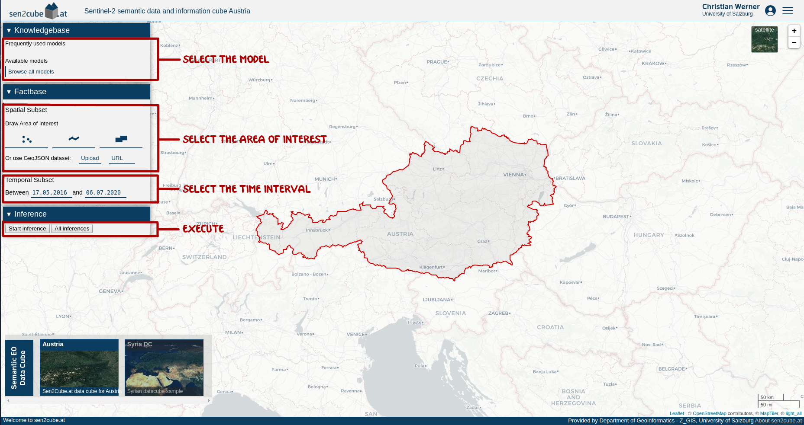
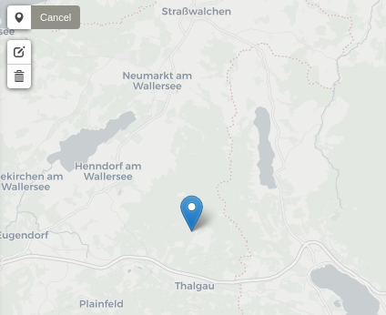
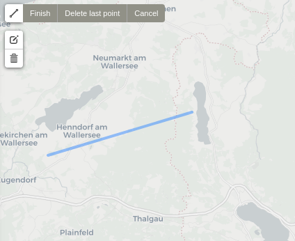
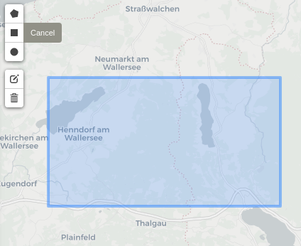
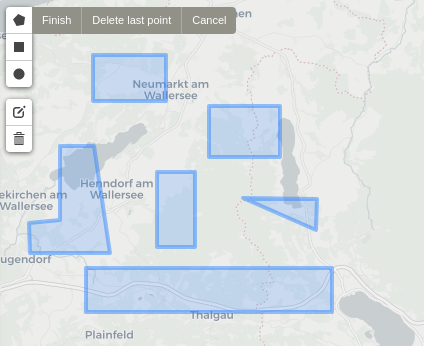
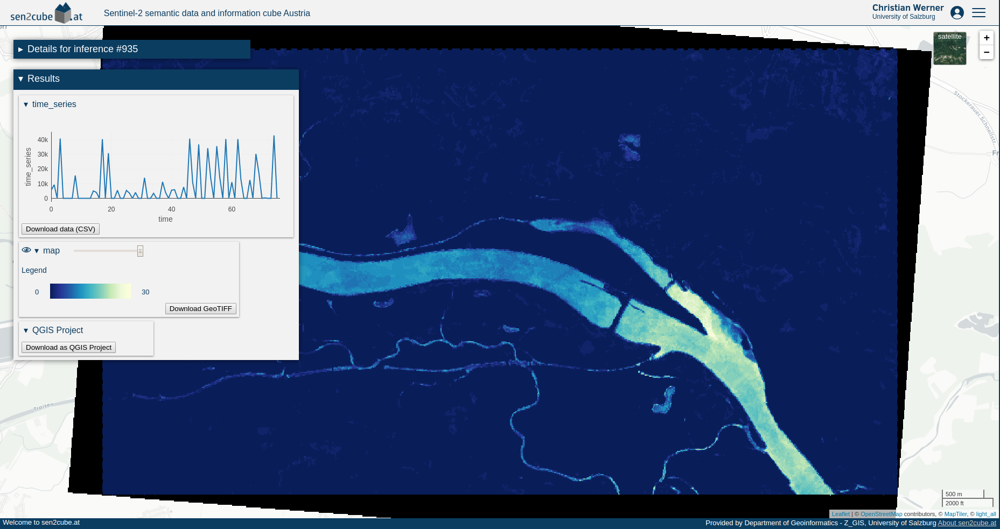

# Getting started

The web-frontend of our semantic querying interface can be found online at [demo.sen2cube.at](https://demo.sen2cube.at/app). The interface is fully web-based. There is no need to install additional software.

## Components

A semantic query has three main components:

- **Model**: This forms the core of the query, in which the semantic concepts are defined, and the desired results are formulated.
- **Area of Interest**: This defines the spatial extent of the query.
- **Time Interval**: This defines the temporal extent of the query.

## Workflow

Each component can be set in the pane on the left side of the webpage.

{width=100%}

### Selecting the model

Clicking `Browse all models` shows a list of pre-constructed models that can be used directly. Add the end of that list, one can click the `+` icon to construct a new model. For that, read the documentation on [Model Construction]().

### Selecting the area of interest

The area of interest can be drawn within the country borders of Austria, in three different ways:

- As a **point** or a **set of points**.
- As a **line** or a **set of lines**.
- As a **polygon** or a **set of polygons**.

{width=32%} &nbsp; {width=32%} &nbsp; {width=32%}

Valid areas of interest can also be non-rectangular shaped or non-continuous.

{width=32%} &nbsp; {width=32%} &nbsp; {width=32%}

The drawn shapes are internally translated into [GeoJSON format](https://geojson.org/). Instead of drawing the shapes by hand, it is also possible to use a external GeoJSON file, either by uploading it, or linking to it.

### Selecting the time interval

The time interval is defined by a start date and an end date. The interval is *closed* at both sides, meaning that both the specified start date and end data are included. Currently, the Austrian semantic data cube contains data from < insert date here > to < insert date here >.

### Executing the query

Once the model, the area of interest and the time interval are set, the query can be execute by clicking `Start inference`. Depending on the size and complexity of the query, execution might take some time.

### Viewing the results

When successfully processed, results can be viewed by clicking the `View results` button that will appear. Results with a spatial dimension will be visualized on a map, and results with only a temporal dimension will be visualized as a line graph if the data values are numerical. Most other types of data will be visualized as a plain list. Besides the visualization, there is also the option to download the results as either a [GeoTIFF](https://en.wikipedia.org/wiki/GeoTIFF#:~:text=GeoTIFF%20is%20a%20public%20domain,spatial%20reference%20for%20the%20file.) (for spatial data) or [CSV](https://en.wikipedia.org/wiki/Comma-separated_values) (for non-spatial data) file. Lastly, one can also choose to download a result as a [QGIS Project File](https://docs.qgis.org/3.10/en/docs/user_manual/introduction/project_files.html).

{width=100%}

In the case the query could *not* be processed successfully, an error message describing the problem will appear instead.