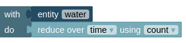
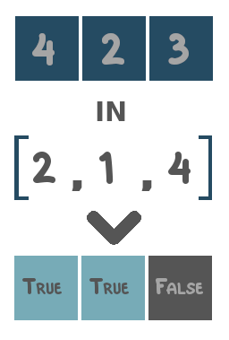
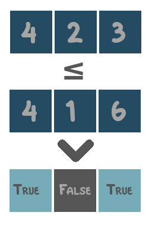
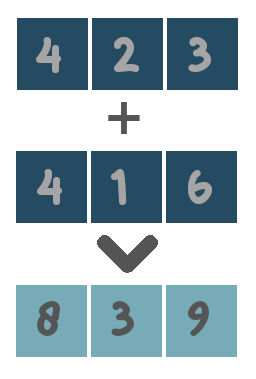
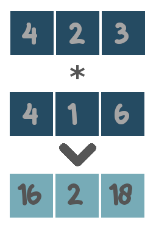
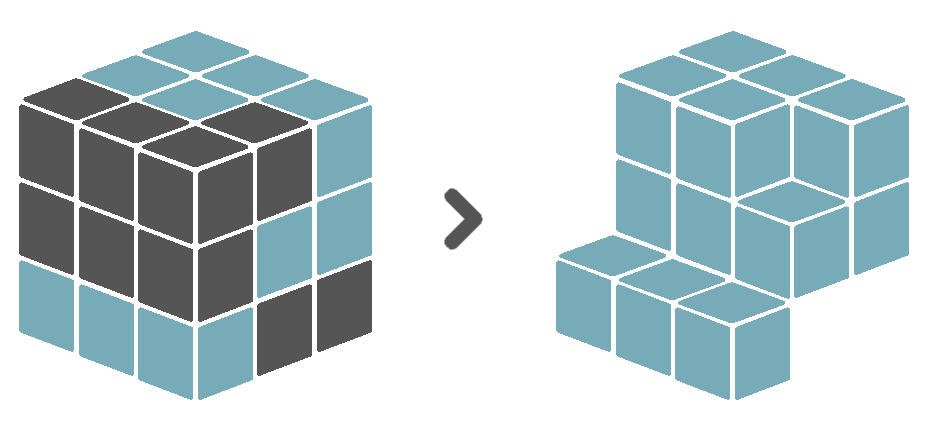
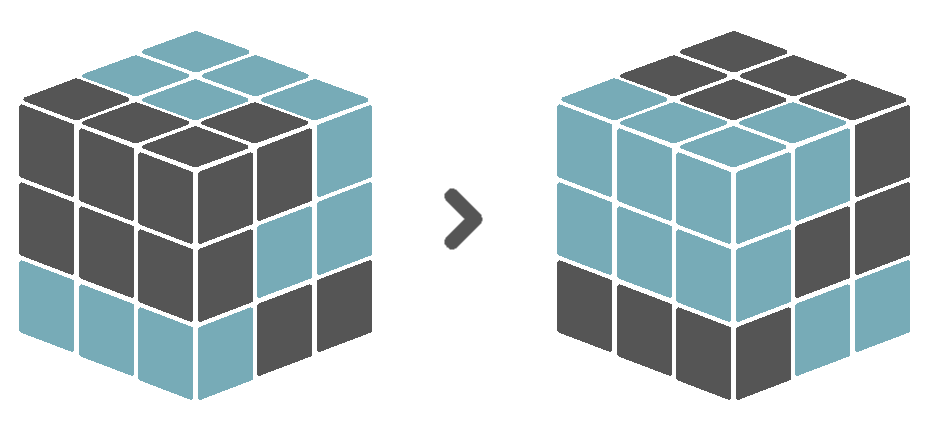
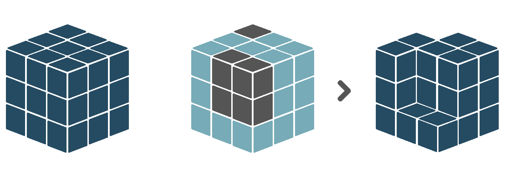
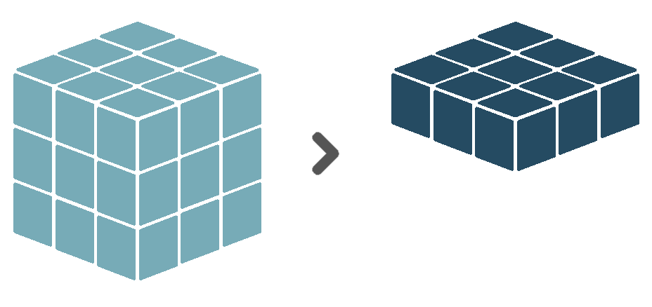
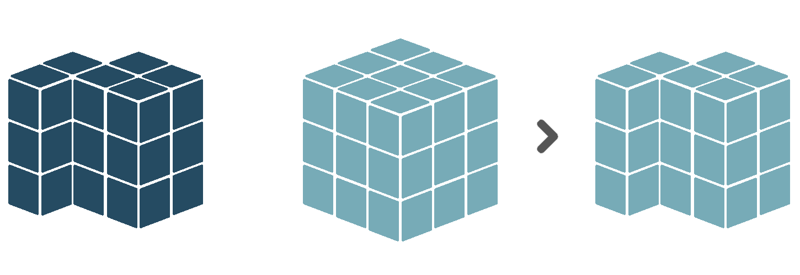

# Building blocks

Models are constructed by connecting several *building blocks*, that each represent a distinct, clearly defined task or value. There are different classes of blocks, which are described in detail below.

## Definitions

Definition blocks store the output of a collection of other blocks, such that it can be accessed anywhere else in the model. Several types of definitions exist.

```{block, type='rmdnote'}
All definitions have to be named. Bear in mind that these names should be unique!
```

### Entities and properties

An entity is an identifiable phenomenon of interest in the real world that is not further subdivided into phenomena of the same kind. For example, *a lake* or *a field*. In the current implementation of Sen2Cube, however, we refer to entities also at a lower, more general level, for example *water* or *vegetation*. Entity definitions describe for each observation in the spatio-temporal extent of the query if it is identified as being part of the entity or not. For example, when we define the entity *water*, the entity definition will store a set of boolean observations, having a value of `True` when it was identified as being water, and `False` otherwise. These observations are aligned along two spatial dimensions, i.e. the X and Y coordinates of the observations geographical locations, and one temporal dimension, i.e. the timestamps at which the observations were made. Therefore, we call this data structure a *cube*. See the illustration below, where blue blocks represent observations that were identified as water, and grey blocks represent observations that were not identified as water.

<center>

{width=50%}

</center>

Entities are always defined by means of one or more **properties** they have. For example, a property of water is its blueish color, but for larger water bodies also its approximate flatness (i.e. a slope of approximately 0%). An entity definition block thus *has* to be followed by one or more property definition blocks.

Entity definition blocks - and their corresponding property definition blocks - are exclusively used inside the **semantic concept dictionary** component of the model. In the application component, stored entity definitions can be retrieved, wrangled and exported.

### Results

A result is the output of a single semantic query. Depending on the processes that are used in the query, results can be single values, one-dimensional arrays or multi-dimensional arrays (i.e. *cubes*). Result definition blocks are exclusively used inside the **application** component of the model. Stored result definitions can be retrieved at any place within other result definitions inside the same model. Not every result definition *has* to be exported. That is, a result definition can also be used as a preliminary outcome, that serves only as a first step towards the final output of the query.

### Seasons and partitions

When performing analyses over time, splitting the temporal dimension is a common task. For example, instead of the *overall water count*, we are interested to know the *average water count per season*, or the *ratio of summer water counts and winter water counts*. Seasons like *summer* and *winter* are specified, distinct subsets of the temporal dimension. In Sen2Cube, there is the option to customly define **seasons**. For example:

- The harvesting season as the time period from August to October.
- The sowing season as the time period from March to May.
- The rain season as the time period from December to May.
- The dry season as the time period from August to November.

Distinct, but related seasons can then be combined into a **partition** of the temporal dimension. Just like summer, autumn, winter and spring together form the *meteorological seasons*, the defined harvesting and sowing seasons can together form the *agricultural seasons*, and the rain and dry season the *tropical seasons*. As can be seen, the customly defined partition does not have to fill up a full year. A user is free to define any desired partition, as long as the included seasons span distinct time ranges.

Season and partition definition blocks are considered semantic concepts, and are therefore exlusively used inside the **semantic concept dictionary** component of the model. Unlike entities and results, the seasons and partition definitions are *not* evaluated at the moment they are defined. The temporal dimension of a data cube is only split at the moment a specific season or partition is referenced inside the application component of the model.

## Data

Data blocks enable to access the source data of the semantic querying system. This is important when defining entities, but for example also when returning cloud-free mosaics. Several data sources can be accessed.

### Appearance

< Explain in one or two sentences >

### Atmosphere

< Explain in one or two sentences >

### Reflectance

< Explain in one or two sentences >

### Topography

< Explain in one or two sentences >

### Artifacts

< Explain in one or two sentences >

### Metadata

Metadata refers to the metadata of the satellite images from which the data were taken. For example, one can replace all observed values in an array by the timestamps at which those observations were made.

```{block, type='rmdwarning'}
Currently, timestamps are the only supported metadata return value.
```

## Verbs

The core processing blocks are called *verbs*. Each verb represents a specific *action* that can be applied to a data cube. The verb blocks are therefore labelled with a single action word (i.e. a *verb*) that describes what the process is doing.

Such an action is always applied to a specific data cube, like a stored entity or result definition, or some retrieved source data. In terms of blocks, this is modelled by a *with-do* structure, where a cube is referenced in the *with* part, and the action to be applied to it in the *do* part. For example, a single reduction over time applied to our defined *water* entity cube will look like this:

<center>

{width=50%}

</center>

Often, it is desired to apply more than one action to the same cube. This is possible by providing a *chain of verbs*, where the output of the first process forms the input for the second process, et cetera. For example, start with the water entity cube, invert the `True` and `False` values, then keep only the `True` values, and then reduce that filtered cube over time. Hence, the processing chain is arranged in the logical order of how you also think about the task.

<center>

{width=50%}

</center>

The functionalities of the different verbs are described below.

### Evaluate
The *evaluate* verb evaluates an expression for *each* observation in the input cube. An expression is structured as follows:

$$
Expression = (Value, Math Operator, Value)
$$

In our case, the left hand value is an observation from the input cube to which the verb is applied. The right hand value can be a corresponding observation from another cube, a list of numbers, or even a single number. Since the expression is evaluated for each observation in the input cube, the output of the evaluate block is a new cube with the *same dimensions* as the input cube.

This is illustrated in the figure below. The blue cube on the left forms the left hand side of the expression, the red cube in the middle forms the right hand side of the expression. The cube on the right with mixed colors is the output of the evaluation. In this case, the blue and red cube have exactly the same dimensions, meaning that each observations in the blue cube has a corresponding observation in the red cube. Lets say we use the mathematical operator `+` as our operator. Then, the value of observation #1 - lets say that is the one on the bottom-left edge - in the output cube equals the value of observation #1 in the blue cube *added to* the value of observation #1 in the red cube. The same yields for all other observations.

<center>

{width=100%}

</center>

However, the cube on right hand side of the expression does not have to have the same dimensions as the one on the left hand side. For example, when our cube on the right hand side *only* has spatial dimensions, the right hand side values are *duplicated* for each timestamp in the left hand side cube. This also works the other way around. In jargon, this is called [array broadcasting](https://machinelearningmastery.com/broadcasting-with-numpy-arrays/).

<center>

{width=100%}

</center>

The same principle applies when the right hand side is only a single value. Then, this value is *duplicated* for each observation in the left hand side cube.

<center>

{width=100%}

</center>

In the Sen2Cube interface, several operators can be used to build expressions.

- **Comparison operators**: operators that compare values and return either `True` or `False`. These are `=`, `in`, `>`, `<`, `≥` and  `≤`. 
- **Logical operators**: operators that combine boolean values (i.e. `True` and `False`). These are `and` and `or`.
- **Algebraic operators**: operators that combine numerical values. These are `+`, `-`, `*` and `\`.

The functionality of each supported operator is illustrated with toy examples below.

```{block, type='rmdnote'}
The **in** operator is special, in the sense that each observation in the input is compared to a **list** of values, rather than to a single value. If the observed value is *in* the given list, the result will be *True*. If not, the result will be *False*. The same list of values is used for each observation in the input cube.
```

```{block, type='rmdcaution'}
Be aware what type of data both sides of the expression contain. For example, the logical operators are only useful when both sides of the expression contain boolean values (i.e. *True* or *False*). The algebraic operators only make sense for numerical values, and not for categories. Et cetera.
```

<center>

{width=24%} {width=24%} {width=24%} {width=24%}

{width=24%} {width=24%} {width=24%} {width=24%}

{width=24%} {width=24%} {width=24%} {width=24%}

</center>

### Filter
The *filter* verb should only be applied to cubes that contain boolean data values. It then keeps *only* those values that are `True`, and removes the values that are `False`. Technically, this is the same as masking a boolean cube by itself (see [Masking]()).

<center>

{width=67%}

</center>

### Groupby and ungroup

The *groupby* verb splits the input cube into distinct groups, based on a given grouping variable. All subsequent operations will the be applied to each group *separately*, until the *ungroup* verb is called. At that point, the groups will be combined back together into a single cube. This workflow is also known as [Split-Apply-Combine](https://pandas.pydata.org/pandas-docs/stable/user_guide/groupby.html). For example, the input cube can be split into groups such that each group contains *exclusively* observations from one specific year. Then, these observations can be reduced over time and over space. What is left is a single value for each year. These values can be combined together along a new time dimension, in which each time coordinate refers to a year.

<center>

{width=100%}

</center>

The Sen2Cube interface offers several pre-defined grouping variables:

- **Temporal grouping variables**: grouping variables that will split the temporal dimension, such that each group contains *exclusively* observations taken within a specific time period. The variables to choose from are `year`, `season`, `month`, `week`, `dayofyear` and `dayofweek`.
- **Spatial grouping variables**: grouping variables that will split the spatial dimensions, such that each group contains *exclusively* observations taken within a specific sub-area inside the defined area of interest. Currently, only a single variable is supported, named `spatialfeature`. This requires the area of interest to consist of multiple, distinct spatial features (point, lines or polygons) that do not intersect with each other. Each of these distinct features will then form a group.

It is also possible to group based on *multiple* grouping variables. For example, when having two years of data with at least one observation each month, grouping by `month` will result in 12 different groups. Observations from January in the first year, will end up in the same group as observations from January in the second year. However, when grouping by `month` *and* `year`, there will be 24 different groups. Such multiple grouping operations are enabled in the block interface by means of a *group list* block.

Thirdly, one can also provide a defined custom [partition]() of the time dimension as a grouping variable.

<center>

{width=32%} {width=32%} {width=32%}

</center>

```{block, type='rmdcaution'}
Currently, the Sen2Cube interface does not support cubes that have *more than one* temporal dimension, or *more than two* spatial dimensions. When grouping with a temporal grouping variable, each group represents a specific time period like a year, a seasons or a month. When combined back together into a single array during ungrouping, a *new* time dimension is created in which each time coordinate refers to one of those groups. Since multiple time dimensions are not allowed, the *original* time dimension *has* to be reduced before ungrouping. The same yields for spatial grouping operations. The *original* spatial dimensions have to be reduced before ungrouping.
```

### Invert
The *invert* verb should only be applied to cubes that contain boolean data values. It then replaces all `True` values by `False` values, and vice versa.

<center>

{width=67%}

</center>

### Label
The *label* verb does not influence the data values in any way. It simply stores a label for the entire input cube. This is useful for example before [concatenating]() several cubes over a new dimension. The label of each cube will then serve as coordinate value of the new dimension.

### Mask
The *mask* verb applies a boolean value mask to the input cube. A boolean value mask is a cube with boolean data values (i.e. `True` and `False`). When an observation in the input cube corresponds to a `True` value in the mask, the observation is kept. However, when an observation in the input cube corresponds to a `False` value in the mask, the observation is removed. 

<center>

{width=100%}

</center>

Similar to the *evaluate* verb, the boolean mask in a masking operation does not have to have the same dimensions as the input cube. For example, when the mask only has spatial dimensions, its values will be *duplicated* for each timestamp in the input cube. When the mask only has a temporal dimension, its values will be *duplicated* for each spatial location in the input cube.

<center>

{width=100%}

</center>

<center>

{width=100%}

</center>

Masking is useful when you want to work only with a subset of observations, based on an expression that references individual observations. For example, you might want to count all observations greater than a certain value, or perhaps remove all observations at locations that were covered by clouds for the majority of time.

### Reduce
Text

<center>

{width=67%}

</center>

<center>

{width=67%}

</center>

### Replace
Text

<center>

{width=100%}

</center>

### Select
The *select* verb takes a subset of the input cube, based on a expression that references dimension coordinates. Currently, only subsetting the temporal dimension is possible. To do so, one can use one or more of the [time value blocks](), which represent either a *time instance*, *time collection* or *time period*. For example, a select operation could be to only keep those observations that were made within the time period between March 2020 and June 2020.

<center>

{width=67%}

</center>

