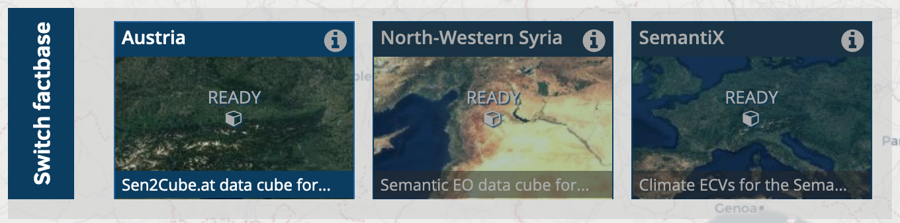
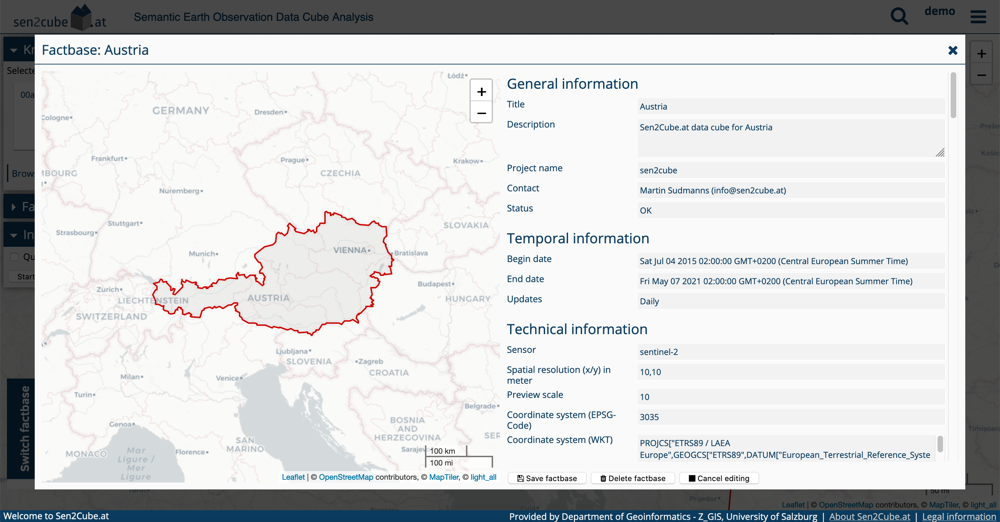
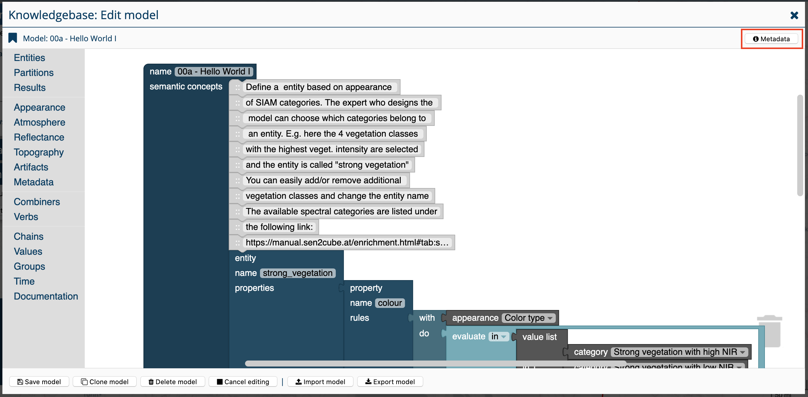
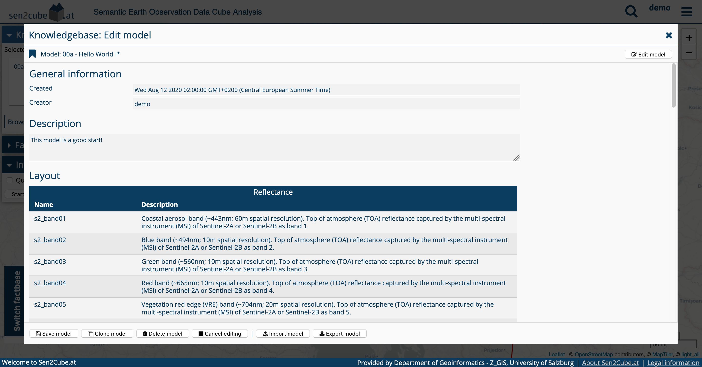
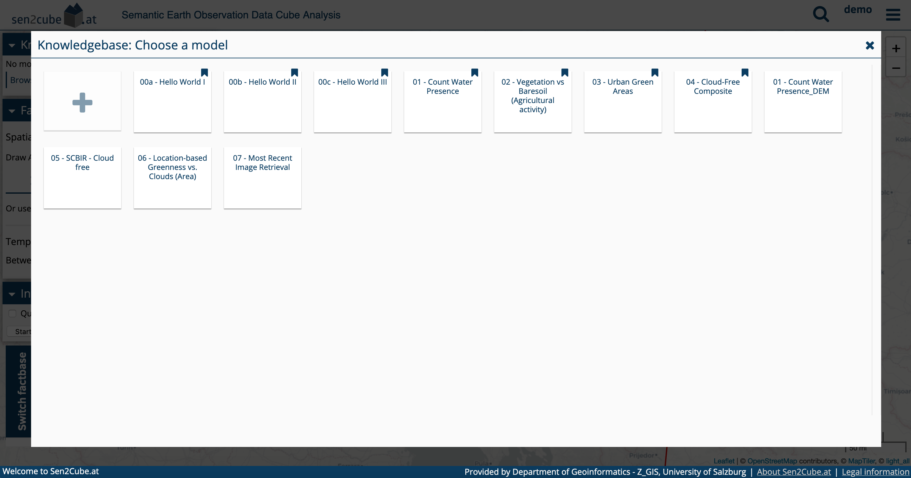
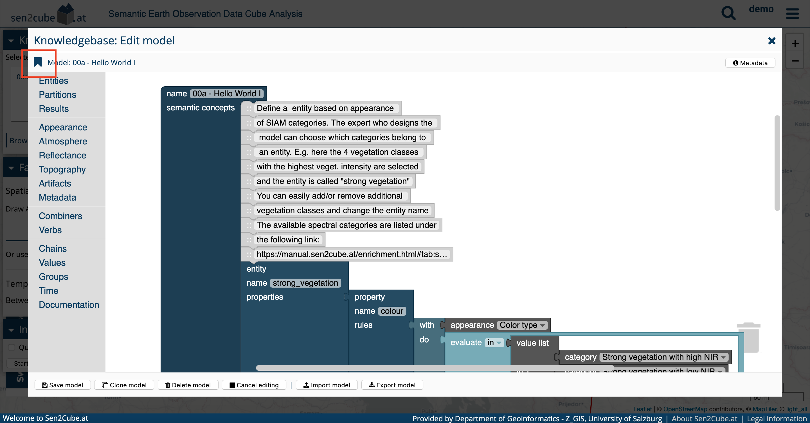
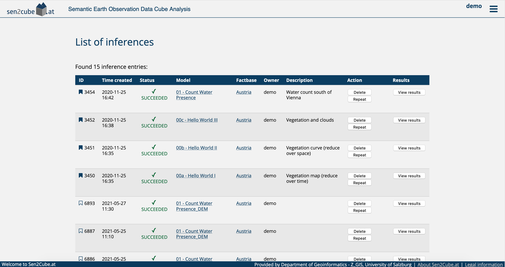
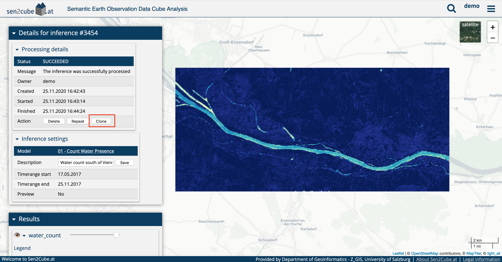

# Advanced usage of the Sen2Cube.at system

## Factbases
### Metadata information about factbases

Every factbase is provided with a set of metadata that may be useful for the semantic querying process. The factbase metadata can be obtained by clicking on the round (i) symbol of the factbase entries.

{width=100%}

{width=100%}

```{block, type='rmdnote'}
Even if the buttons are visible, most users don't have permission to change the settings and information of the factbases. Trying to change them will result in an error. If you have a request for changings of the settings, please contact info@sen2cube.at
```

### Switching between factbases

The Sen2Cube.at system allows switching between different factbases. This can be done by clicking on the target factbase at the bottom of the screen.

{width=100%}


However, switching a factbase may come with side effects that need to be considered.

```{block, type='rmdnote'}
The semantic enrichment produces similar output (colour names), and therefore a lot of models are transferable between the factbase. This means they can be used in more than one factbase. However, suppose there are sensor-specific elements, such as reflectance values. In that case, the model is implicitly tied to the specific sensor. In this case, the model is not transferable anymore, except the factbase was set up identically.
```

```{block, type='rmdwarning'}
When you change the factbase, your query settings will be lost/reset. The reason is that settings such as the area-of-interest or the time period depend on the selected factbase.
```

## Knowledgebase

### Metadata information about models

Every model is provided with metadata, which can help develop and use a model in a semantic query. The model editor allows switching to the metadata view using the button on the top right.

{width=100%}
{width=100%}

The metadata view allows entering a detailed description of the model with unlimited text length. The layout provides more information about the currently selected **factbase** and can be helpful during the model development phase.

### Marking models as favourite

It is possible to select and mark one or more models that as a favourite. They will be shown first in the knowledgebase. The symbol is the typical bookmark, dark (filled) when the model is selected as favourite and bright (not filled) when they are not. The model editor allows to select and de-select a model as a favourite by clicking on the symbol.

{width=100%}
{width=100%}

```{block, type='rmdnote'}
Marking a model as a favourite affects only the presentation in the knowledgebase; it does not affect the performance etc.
```

## Inferences and semantic queries

### Marking inferences as favourite

Similar to models, it is also possible to mark inferences as a favourite. They will be then sorted so that they appear first in the interfaces. The symbol is the typical bookmark, dark (filled) when the inference is selected as favourite and bright (not filled) when they are not. Inferences can be easily selected and de-selected as a favourite within the list of inferences by clicking on the bookmark symbol.

{width=100%}


### Cloning inference settings

Sometimes it is necessary to re-execute a semantic query with slightly different settings. In these cases, it is not required to draw the area-of-interest etc. again. Instead, it is possible to *clone* the inference settings in a new inference. While the *repeat* button simply re-executes the query, the *clone* button clones the inference settings on the main page.

{width=100%}
```{block, type='rmdwarning'}
When you clone the inference settings, existing settings will be overwritten!
```

