# Building blocks {#blocks}

Models are constructed by connecting several *building blocks*, where each block represents a distinct, clearly defined task or value. There are different classes of blocks, which are described in detail below.

## Definitions

Definition blocks store the output of a collection of other blocks, such that it can be accessed anywhere else in the model. Several types of definitions exist.

```{block, type='rmdcaution'}
All definitions must be named. Bear in mind that these names should be unique!
```

### Entities and properties

#### Entities {#entity_definition}
An entity is an identifiable phenomenon of interest in the real world that is not further subdivided into phenomena of the same kind. For example, *a lake* or *a field*. The Sen2Cube.at system allows to refer to entities at different semantic levels, including *water* or *vegetation*. The capability of eventually selecting entities on a higher or lower semantic level depends on the capabilities of the Earth observation sensor, noise during the observation, and the model construction. Entity definitions describe for each observation if it is identified as being part of this type of entity or not in the spatio-temporal extent of the semantic query. For example, when we define the entity *water*, the entity definition will store a set of boolean observations having a value of `True` when it was identified as being water, and `False` otherwise. These observations are aligned along two spatial dimensions, i.e. the X and Y coordinates of the observations geographical locations, and one temporal dimension, i.e. the timestamps at which the observations were made. Therefore, we call this data structure a *cube*. See the illustration below, where blue blocks represent observations that were identified as water, and grey blocks represent observations that were not identified as water.

<center>

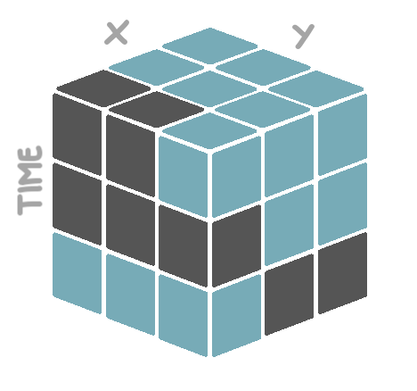{width=50%}

</center>

```{block, type='rmdnote'}
The observations will be associated to an entity type, not an individual entity. This means that observations might be associated with an entity type *water*, but not to groups of observations that may constitute different water bodies.
```

#### Properties {#property_definition}
Entities are always defined by means of one or more **properties**. For example, a property of water may be its blueish color, but for larger water bodies also its approximate flatness (i.e. a slope of approximately 0%). An entity definition block thus *must* be followed by one or more property definition blocks. Properties must not be mutually exclusive and should not overlap, i.e., multiple properties will be always connected with *AND*. Consider a real-world entity lake where three properties *color*, *texture*, and *compactness*: They might be fuzzy or optional, but they are not either-or. I.e., a lake may appear blue as property color *AND* appear flat as property texture, but is not blue *OR* flat. There might be situations where one thinks of either-or options in some cases but this is an indicator that the property is not defined appropriately and should be solved differently.

Entity definition blocks - and their corresponding property definition blocks - are exclusively used inside the **semantic concept dictionary** component of the model. In the application component, stored entity definitions can be retrieved, wrangled, and exported.

### Results {#result_definition}

A result is the output of an inference, while one inference may have more than one results of different types. Depending on the processes that are used in the semantic query, results can be single values, one-dimensional arrays or multi-dimensional cubes. Result definition blocks are exclusively used inside the **application** component of the model. Stored result definitions can be retrieved at any place within other result definitions inside the same model. *Not* every result definition needs to be exported. That is, a result definition can also be used as a preliminary output that serves as intermediate step towards the final output of the semantic query.

### Seasons and partitions

#### Seasons {#season_definition}

When performing analyses over time, splitting the temporal dimension is a common task. For example, instead of the *overall water count*, we are interested to know the *average water count per season*, or the *ratio of summer water counts and winter water counts*. Seasons that typically appear on temperate latitudes like *summer* and *winter* are specified. In Sen2Cube.at, there is the option for different definitions of **seasons**. For example:

- The harvesting season as the time period from August to October.
- The sowing season as the time period from March to May.
- The rain season as the time period from December to May.
- The dry season as the time period from August to November.

#### Partitions {#partition_definition}
Distinct, but related seasons can then be combined into a **partition** of the temporal dimension. Just like summer, autumn, winter and spring together form the *meteorological seasons*, the defined harvesting and sowing seasons can together form the *agricultural seasons*, and the rain and dry season the *tropical seasons*. As can be seen, the custom defined partition does not have to fill up a full year. You are free to define any desired partition, as long as the included seasons span distinct time ranges.

Season and partition definition blocks are considered semantic concepts, and are therefore exclusively used inside the **semantic concept dictionary** component of the model. Unlike entities and results, the seasons and partition definitions are *not* evaluated at the moment they are defined. The temporal dimension of a cube is only split at the moment a specific season or partition is referenced inside the application component of the model.

## Data and information

These blocks specify the access of the data and information in the factbase, e.g. reflectance values of satellite imagery or semantically enriched information. This is important for defining entities, but also, for example, for creating cloud-free mosaics. We separate the available data into the types **appearance**, **atmosphere**, **reflectance**, additional data sources such as **topography**, and **artifacts**. Further, some **metadata** from the Earth observation data can be accessed.

### Appearance

The *appearance* block refers to information about how an Earth observation measurement of the Earth's surface looks based on an interpretation of what it represents. This can be calculated indices (e.g. multi-spectral greenness indices, multi-spectral brightness values) or categories (e.g. multi-spectral color spaces/categories) with some level of semantic association. In the case of the Sen2Cube.at project, SIAM semantic enrichment generates color types with low-level semantic association that are accessible using these blocks. This block is mainly used in the Sen2Cube.at system and relates to all land cover and land use questions.

### Atmosphere

The *atmosphere* block refers to all interpretations of measurements or additional information associated with atmospheric phenomena or influences of an image (i.e., not the Earth's surface). This includes estimates of haze, cloud cover, fog, airborne particulates, etc. that inhibit Earth surface applications, or are of specific interest to atmospheric applications. For example, clouds may be treated as noise in most applications related to land cover, however, might be specifically selected to query for cloud-free images.

### Reflectance

The *reflectance* block refers to calibrated reflectance values (e.g. top-of-atmosphere, bottom-of-atmosphere) of the Earth observations. The reflectance values can be directly accessed using this data block on an individual band basis for a given sensor (i.e. calibrated pixel values in each captured band for a given sensor/platform). An example application of this value is to create a cloud-free composite or retrieving the most recent image with less than 10% clouds.

### Topography

The *topography* block refers to any data or information related to the Earth's topography (e.g. digital elevation models with derived aspect and slope). Example applications might be to to separate observations that appear as water or shadow in mountainous areas or to stratify vegetation phenology.

```{block, type='rmdwarning'}
Accessing these data is not yet supported and will be available soon.
```

### Artifacts

The *artifacts* block includes all measurements or interpretations of measurements that may be associated with some errors or noise of invalid measurements (i.e., clouds don't fall in this category). An example application of this block is to create quality layers with perceived or detected measurement errors or to investigate effects of differences in quality across an image or edges of acquisition swaths.

### Metadata

The *metadata* block includes descriptive and technical metadata of the original satellite images. An example application is to identify the timestamps from individual pixels that contributed to the cloud-free composite if a best-available-pixel approach is is used.

```{block, type='rmdcaution'}
Currently, timestamps are the only supported metadata return value.
```

## Verbs

The core processing blocks are called *verbs*. Each verb represents a specific *action* that can be applied to a data cube. The verb blocks are therefore labelled with a single action word (i.e. a *verb*) that describes what the process is doing.

Such an action is always applied to a specific cube, like a stored entity or result definition, or some retrieved source data. In terms of blocks, this is modelled by a *with-do* structure, where a cube is referenced in the *with* part, and the action to be applied to it in the *do* part. For example, a single reduction over time applied to our defined *water* entity cube will look like this:

<center>

{width=50%}

</center>

Often, it is desired to apply more than one action to the same cube. This is possible by providing a *chain of verbs*, where the output of the first process forms the input for the second process, et cetera. For example, start with the water entity cube, invert the `True` and `False` values, then keep only the `True` values, and then reduce that filtered cube over time. Hence, the processing chain is arranged in the logical order of how you also think about the task.

<center>

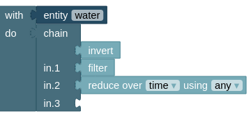{width=50%}

</center>

Each *verb* block is described in more detail below.

### Evaluate {#evaluate}

The *evaluate* verb evaluates an expression for *each* observation in the input cube. An expression is structured as follows:

$$
Expression = (Value, Math Operator, Value)
$$

In our case, the left hand value is an observation from the input cube to which the verb is applied. The right hand value can be a corresponding observation from another cube, a list of numbers, or even a single number. Since the expression is evaluated for each observation in the input cube, the output of the evaluate block is a new cube with the *same dimensions* as the input cube.

This is illustrated in the figure below. The blue cube on the left forms the left hand side of the expression, the red cube in the middle forms the right hand side of the expression. The cube on the right with mixed colors is the output of the evaluation. In this case, the blue and red cube have exactly the same dimensions, meaning that each observations in the blue cube has a corresponding observation in the red cube. Lets say we use the mathematical operator `+` as our operator. Then, the value of observation #1 - lets say that is the one on the bottom-left edge - in the output cube equals the value of observation #1 in the blue cube *added to* the value of observation #1 in the red cube. The same yields for all other observations.

<center>

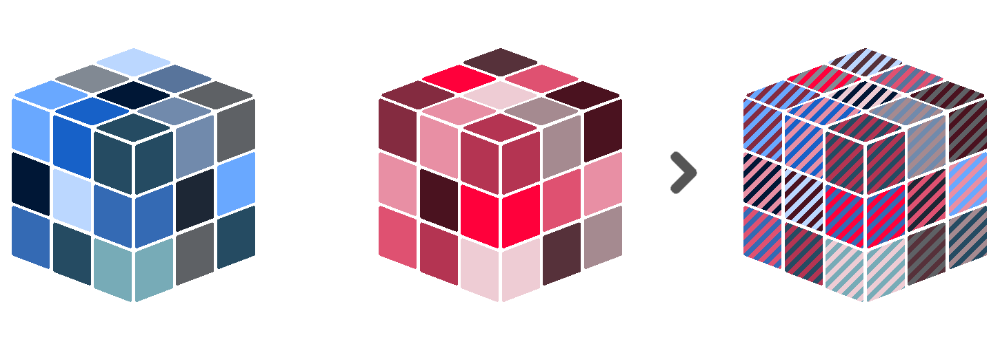{width=100%}

</center>

However, the cube on right hand side of the expression can have different dimensions than the one on the left hand side. For example, when our cube on the right hand side *only* has spatial dimensions, the right hand side values are *duplicated* for each timestamp in the left hand side cube. This also works the other way around. In jargon, this is called [array broadcasting](https://machinelearningmastery.com/broadcasting-with-numpy-arrays/).

<center>

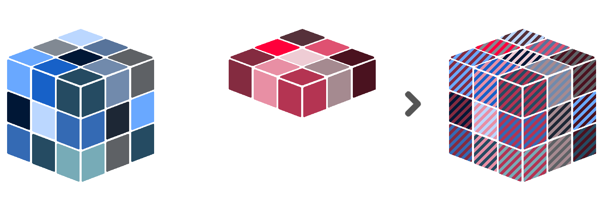{width=100%}

</center>

The same principle applies when the right hand side is only a single value. Then, this value is *duplicated* for each observation in the left hand side cube.

<center>

{width=100%}

</center>

Sen2Cube.at has several built-in operators that can be used to build expressions.

- **Comparison operators**: operators that compare values and return either `True` or `False`. These are `=`, `in`, `>`, `<`, `≥` and  `≤`.
- **Logical operators**: operators that combine boolean values (i.e. `True` and `False`). These are `and` and `or`.
- **Algebraic operators**: operators that combine numerical values. These are `+`, `-`, `*` and `\`.

The functionality of each supported operator is illustrated with toy examples below.

```{block, type='rmdnote'}
The **in** operator is special, in the sense that each observation in the input cube is compared to a **list** of values, rather than to a single value. If the observed value is *in* the given list, the result will be *True*. If not, the result will be *False*. The same list of values is used for each observation in the input cube.
```

```{block, type='rmdcaution'}
Be aware what type of data both sides of the expression contain. For example, the logical operators are only useful when both sides of the expression contain boolean values (i.e. *True* or *False*). The algebraic operators only make sense for numerical values, and not for categories. Et cetera.
```

<center>

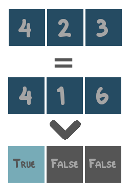{width=24%} {width=24%} {width=24%} {width=24%}

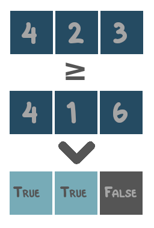{width=24%} {width=24%} {width=24%} 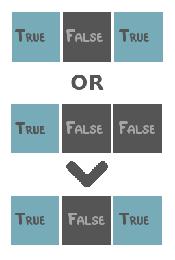{width=24%}

{width=24%} 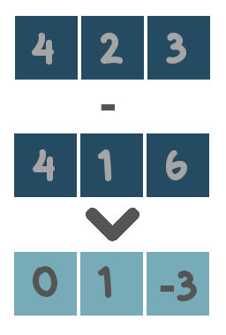{width=24%} {width=24%} {width=24%}

</center>

### Filter {#filter}

The *filter* verb should only be applied to cubes that contain boolean data values. It then keeps *only* those values that are `True`, and removes the values that are `False`. Technically, this is the same as masking (see \@ref(mask)) a boolean cube by itself.

<center>

{width=67%}

</center>

### Group by and ungroup

#### Group by {#groupby}
The *group by* verb splits the input cube into distinct groups, based on a given grouping variable. All subsequent operations will the be applied to each group *separately*, until the *ungroup* verb is called. At that point, the groups will be combined back together into a single cube. This workflow is also known as [Split-Apply-Combine](https://pandas.pydata.org/pandas-docs/stable/user_guide/groupby.html). For example, the input cube can be split into groups such that each group contains *exclusively* observations from a specific year. Then, these observations can be reduced over time and over space. What is left is a single value for each year. These values can be combined together along a new time dimension, in which each time coordinate refers to a year.

<center>

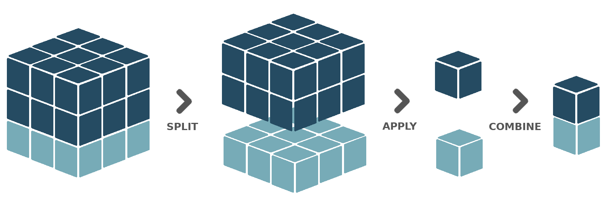{width=100%}

</center>

The Sen2Cube.at interface offers several pre-defined grouping variables:

- **Temporal grouping variables**: grouping variables that will split the temporal dimension, such that each group contains *exclusively* observations taken within a specific time period. The variables to choose from are `year`, `season`, `month`, `week`, `dayofyear` and `dayofweek`.
- **Spatial grouping variables**: grouping variables that will split the spatial dimensions, such that each group contains *exclusively* observations taken within a specific sub-area inside the defined area-of-interest. Currently, only a single variable is supported, named `spatialfeature`. This requires the area-of-interest to consist of multiple, distinct spatial features (point, lines or polygons) that do not intersect with each other. Each of these distinct features will then form a group.

It is also possible to group based on *multiple* grouping variables. For example, when having two years of data with at least one observation each month, grouping by `month` will result in 12 different groups. Observations from January in the first year, will end up in the same group as observations from January in the second year. However, when grouping by `month` *and* `year`, there will be 24 different groups. Such multiple grouping operations are enabled in the block interface by means of a *group list* block.

Thirdly, you can also provide a defined custom partition (see \@ref(partition)) of the time dimension as a grouping variable.

<center>

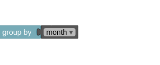{width=32%} 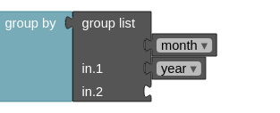{width=32%} {width=32%}

</center>

```{block, type='rmdcaution'}
Currently, the Sen2Cube.at interface does not support cubes that have *more than one* temporal dimension, or *more than two* spatial dimensions. When grouping with a temporal grouping variable, each group represents a specific time period like a year, season or month. When combined back together into a single cube during ungrouping, a *new* time dimension is created in which each time coordinate refers to one of those groups. Since multiple time dimensions are not allowed, the *original* time dimension *must* be reduced before ungrouping. The same yields for spatial grouping operations. The *original* spatial dimensions *must* be reduced before ungrouping.
```

#### Ungroup {#ungroup}
After grouping, all subsequent operations will the be applied to each group *separately*, until the *ungroup* verb is called. At that point, the groups will be combined back together into a single cube.

### Invert {#invert}

The *invert* verb should only be applied to cubes that contain boolean data values. It then replaces all `True` values by `False` values, and vice versa.

<center>

{width=67%}

</center>

### Label {#label}

The *label* verb does not influence the data values in any way. It simply stores a label for the entire input cube. This is useful for example before concatenating (see \@ref(concatenate)) several cubes over a new dimension. The label of each cube will then serve as coordinate value of the new dimension.

### Mask {#mask}

The *mask* verb applies a boolean value mask to the input cube. A boolean value mask is a cube with boolean data values (i.e. `True` and `False`). When an observation in the input cube corresponds to a `True` value in the mask, the observation is kept. However, when an observation in the input cube corresponds to a `False` value in the mask, the observation is removed.

<center>

{width=100%}

</center>

Similar to the *evaluate* verb, the boolean mask in a masking operation can have different dimensions than the input cube. For example, when the mask only has spatial dimensions, its values will be *duplicated* for each timestamp in the input cube. When the mask only has a temporal dimension, its values will be *duplicated* for each spatial location in the input cube.

<center>

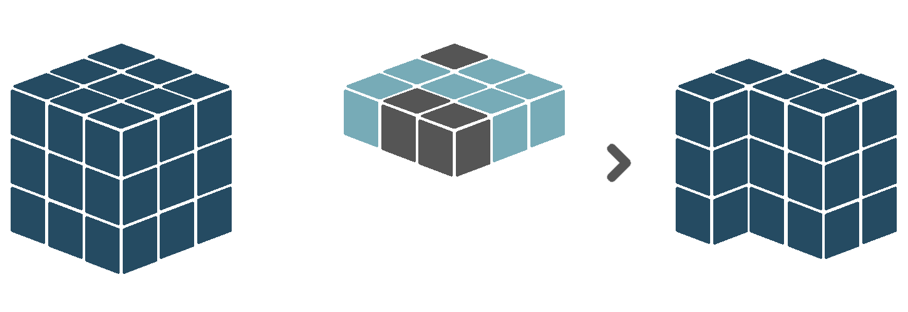{width=100%}

</center>

<center>

{width=100%}

</center>

### Reduce

The *reduce* verb applies a reduction function over a certain dimension or set of dimensions. That means that for each unique combination of coordinate values of all other dimension in the input cube, the values of the dimension(s) to be reduced over are summarized to a single value, based on some function. For example, assume a input cube with one temporal and two spatial dimensions. Basically, this means that for a each location in space, we have multiple observations, each made at a different moment in time. When we reduce this cube over the time dimension, using *mean* as reduction function, we reduce our observed values to only *a single* value per spatial location, equal to the *average* of all observed values at that location. This removes the time dimension, leaving us with a cube that only has spatial dimensions.

<center>

{width=67%}

</center>

Similarly, we can also reduce the spatial dimensions instead, ending up with a single value per timestamp. The Sen2Cube.at interface only supports reduction of the two spatial dimensions at once, and *not* of either the X or Y dimension separately.

<center>

{width=67%}

</center>

Sen2Cube.at has several built-in reduction functions that can be used.

```{block, type='rmdcaution'}
Be aware what type of data and what dimensions both the input cube contains. Some reduction functions are only useful when applied to boolean values (i.e. *True* and *False*). Others, for example calculation of the mean or the sum, make sense for numerical data, but not for categorical or boolean data. Et cetera. Also, some reduction functions are only meant to be applied to the time dimension, while others are only meant to be applied to the spatial dimensions.
```

<center>

{width=32%} 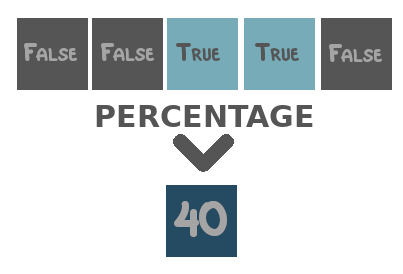{width=32%} 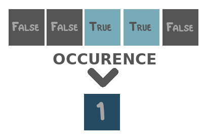{width=32%} 

{width=32%} {width=32%} {width=32%} 

{width=32%} {width=32%} 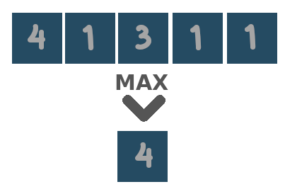{width=32%} 

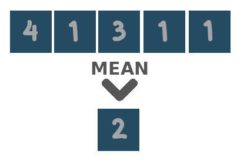{width=32%} {width=32%} {width=32%}

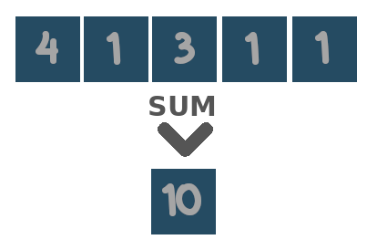{width=32%} 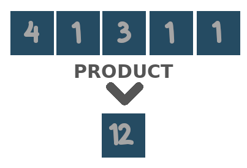{width=32%}

</center>

Two special reduction functions are `area` and `duration`. The first is meant to be applied to the *spatial dimensions*, and equals the count over space multiplied by the area of a single pixel in square meters. The latter is meant to be applied to the *temporal dimension*, and equals the count over time, after resampling the observations to day-level. That is, when there are two observations on the same day, they will be counted as *one*.

<center>

{width=32%} 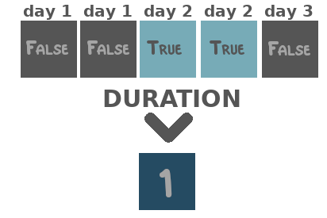{width=32%}

</center>

### Replace {#replace}

The *replace* verb replaces the values of the *valid* observations of the input cube (so *not* the missing values!) by the values of the corresponding observations in another cube.

<center>

{width=100%}

</center>

### Select {#select}

The *select* verb selects a subset of the coordinates of a certain dimension, and keeps only the observations in the input cube that align to those coordinate values. Currently, only subsetting the temporal dimension is possible. To do so, you can use one or more of the time value blocks (see \@ref(time)), which represent either a *time instant*, *time collection* or *time period*. For example, a select operation could be to only keep those observations that were made within the time period between March 2020 and June 2020.

<center>

{width=67%}

</center>

```{block, type='rmdnote'}
Selection is similar to masking, in the sense that they both take a subset of the data. During masking, the subset is defined by another cube containing boolean values. During selection, however, the subset is defined by addressing coordinate values directly.
```

## Combiners

Verbs are applied to a single input cube, such as a stored entity or result definition, or some retrieved source data. However, it is also possible to first combine several cubes together into a single one, and apply verbs to that combined cube. The *combiner* blocks that facilitate this are described below.

### Concatenate {#concatenate}

The *concatenate* combiner combines multiple input cubes along an existing or a new dimension into a single, larger cube. When combining along an existing dimension, this dimension must be present in all input cubes, and all input cubes need to have *different* coordinate values for that dimension.  For example, input cube A has a time dimension with 01-01-2020 and 02-01-2020 as coordinate values. Input cube B has a time dimension with 03-01-2020 as coordinate values. Concatenating the two along the time dimension, results in a single cube with a time dimension of length 3, containing 01-01-20, 02-01-2020 *and* 03-01-2020 as coordinate values.

<center>

{width=100%}

</center>

Concatenating along a new dimension will create an output cube with a new dimension, for which observations coming from input *cube A* will have a coordinate value *A*, observations coming from input *cube B* a coordinate value *B*, etc. What we refer to as *A* and *B* will, in practice, be the label (see \@ref(label)) associated with the input cube.

<center>

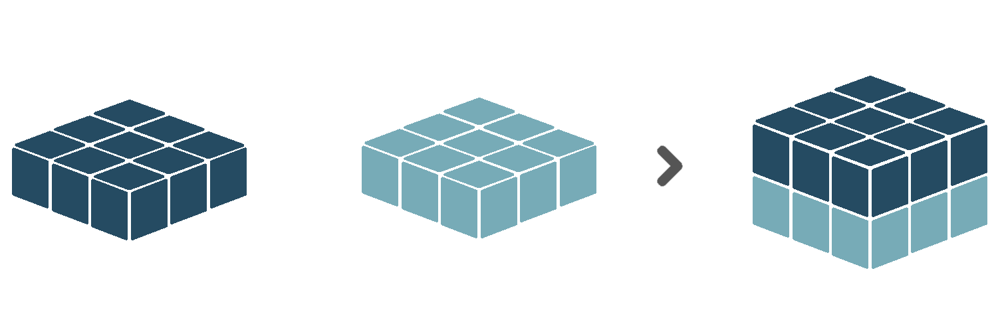{width=100%}

</center>

```{block, type='rmdcaution'}
Except the dimension to be concatenated over, all cubes provided to the concatenate combiner are expected to have *matching shapes*.
```

### Compose {#compose}

The *compose* combines multiple cubes with *boolean* data values, into a single cube with *categorical* data values. It requires the input cubes to be *distinct*. With that we mean, when an observation in input cube A is `True`, the corresponding observations (i.e. having the same coordinates) in the other input cubes can *not* be `True`. Then, the output cube will assign category value 1 to all True-observations of input cube A, category value 2 to all True-observations of input cube B, et cetera.

<center>

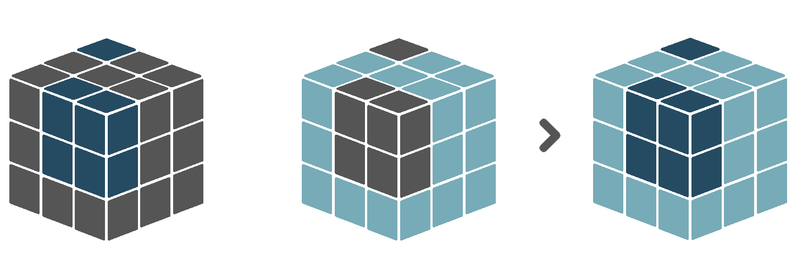{width=100%}

</center>

### Merge {#combine}

The *merge* combiner works the same as the *evaluate* verb (see \@ref(evaluate)), but allows for an expression with more than two variables. For example, *cube A + cube B + ... + cube n*. It offers only the logical and algebraic operators. The output cube will always have the same dimensions as the *first* input cube.

## Time {#time}

Time value blocks refer to the temporal dimension of the query. They allow to subuset cubes by time, customly define seasons, et cetera. There are three different time value blocks.

### Time instant {#time_instant}

A *time instant* is a specific moment in time. It can be modelled with three components: the *year*, the *month* and the *day*. That is, a fully specified time instant can be 2020-07-23. However, not all components need to be specified. One can also leave out the year, and create the time instant XXXX-07-23, which will refer to *all* 23rd of July dates in the overall time interval of the query. Similarly, 2020-07-XX will refer to all days in July 2020, and XXXX-07-XX to all days in July, for all years in the time interval.

### Time periods {#time_period}

A *time period* is a consecutive period of time, defined with a *from* time instant and a *to* time instant. The interval is closed at both sides, so both the from and to time instants are included in the time period. It is also possible to use not fully specified time instants. For example, the time period from XXXX-05-XX to XXXX-08-XX is the time period from May to August, no matter the year. Thus, when subsetting the time dimension of a cube with this time period, all timestamps that are in either May, June, July or August will be selected, for each year in the overall time interval.

```{block, type='rmdwarning'}
In a time period, the *from* time instant should always preceed the *to* time instant. Currently, that means it is not possible to create time periods like [from XXXX-11-XX to XXXX-01-XX], meaning from November to January. If you want to model such a period of time, you can use a time collection instead
```

### Time collection {#time_collection}

A *time collection* is a list of time instants that do *not* have to be consecutive. For example, the time collection [XXXX-05-XX, XXXX-08-XX] refers to all timestamps in May and August.

## Space

```{block, type='rmdwarning'}
Currently there is *no* support for spatial subsetting of cubes, or customly defining areas that divide the overall area-of-interest. Such functionalities might be added in the future.
```

## Comments {#comment}

The comment block allows you to add comments to parts of your model, such that both your future self and others can better understand what is happening. Comment blocks can be added anywhere in the model, and will be ignored during evaluation.
