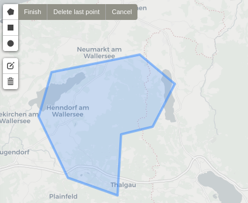
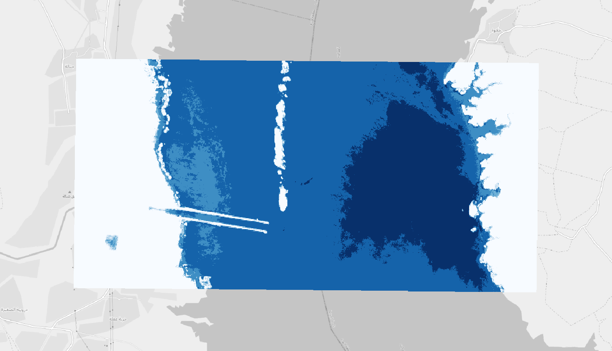

# Getting started {#start}

Sen2Cube.at is a Web-application that can be accessed with a standard browser over the Internet. Installing additional software on your local computer is not necessary. The graphical frontend of our semantic querying interface is available online at [demo.sen2cube.at](https://demo.sen2cube.at/app). Please consult the contact section for options to get access to the demo version.

## Components

Inferring information from data using an expert system (information processing system) is typically achieved by combining a **knowledgebase** and a **factbase** that allows the **inference engine** to process large volumes of data automatically. The knowledgebase contains general or specific knowledge of the world, expressed in rulesets and encoded in models. Thus, the knowledgebase is augmented incrementally through using the system. The factbase contains the raw image data as well as the semantically enriched data.

A semantic query in the Sen2Cube.at system has three main components:

- **Model**: This is the part of the knowledgebase that is used to infer new information. It is a set of rules in which the semantic concepts are defined, and the desired results are formulated.
- **area-of-interest**: This defines the spatial extent (subset) of the factbase that will be input to the inference engine.
- **Time Interval**: This defines the temporal extent (subset) of the factbase that will be input to the inference engine.

```{block, type='rmdnote'}
A semantic query is the execution of a model from the knowledgebase against a selected spatio-temporal subset of the factbase through which new information is inferred.
```

Additionally, it is possible to execute a model in **preview** mode. This is a setting of the **inference engine** options and available for all types of models. A query in preview mode generally will be executed faster as the spatial resolution is reduced by a factor of 10. See the section below for more information.

## Workflow

In the Sen2Cube.at Web-application, each component corresponds to one pane on the left side of the main page.

<center>
{width=100%}
</center>

### Selecting the model

Clicking `Browse all models` shows the models, which are already within the knowledgebase and can be used directly. At the begin of the list, you can click the `+` icon to create a new model. For doing this, it may be useful, read the documentation on model construction (\@ref(model)).

Deleting a model is only possible if it was not used in an inference, i.e.., a semantic query. As information processing system, Sen2Cube.at does not allow to maintain inferences without associated models. Thus, deleting all associated inferences is required prior to deleting a model.

### Selecting the area-of-interest

The area-of-interest can be drawn within the country borders of Austria, in three different ways:

- As a **point** or a **set of points**.
- As a **line** or a **set of lines**.
- As a **polygon** or a **set of polygons**.

<center>
{width=32%} &nbsp; {width=32%} &nbsp; {width=32%}
</center>

Valid areas-of-interest can also be non-rectangular shaped or non-continuous.

<center>
{width=32%} &nbsp; {width=32%} &nbsp; {width=32%}
</center>

The drawn shapes are internally translated into [GeoJSON format](https://geojson.org/). Alternative to manually drawing the areas-of-interest on the map, it is also possible to use already defined representations of common areas-of-interest, such as agricultural fields, municipalities etc. A valid GeoJSON file can be directly uploaded or linked through standard WFS service that allows specifyig GeoJSON as output format such as this one:

```
https://demo.sen2cube.at/ows/000/?service=WFS&version=1.1.0&request=GetFeature&outputFormat=application/json&srsname=EPSG:4326&typename=inspire_feldstuecke_2019&Filter=<Filter><PropertyIsEqualTo><PropertyName>FS_KENNUNG</PropertyName><Literal>73898247</Literal></PropertyIsEqualTo></Filter>
```

Here is an example of how areas-of-interest can be selected

<center>


</center>

### Selecting the time interval

The time interval is defined by a start date and an end date. The interval is *closed* at both sides, meaning that both the specified start date and end date are included. Currently, the Austrian semantic data and information cube contains data since the beginning of the operational phase of Sentinel-2 in Summer 2015 and is constantly updated with the most recent data.

### Executing the query and inferring new information

Once the model, the area-of-interest and the time interval are set, the semantic query can be executed by clicking `Start inference`. Depending on the size and complexity of the query, execution might take some time.

Every semantic query, i.e., inference, will be created internally and executed by a worker as soon as resources are available. If the system is already busy, it may therefore take some time until the inference can be started. Please note that the inferences will **stop automatically after 10 minutes**. Please contact us if you want to process larger volumes of data.

It is possible to stop an inference any time by clicking `Abort inference`. It may take some seconds until you receive the final notification that the inference was aborted.

### Preview-mode

The **preview-mode** can be used for prototypically and interactively develop and test semantic models. The spatial resolution will be reduced by a factor of 10, which usually reduces the processing time significantly. In the case of Sentinel-2 the processing and output pixel size will therefore not be 10x10, but 100x100 meters. Thus, keep in mind the side-effects that this setting may have.

The following example illustrates the effect of the preview mode. They show the execution of the same semantic model of the same AOI and the same time interval, while the first picture shows the result of the query not executed in preview-mode and the second picture shows the result of the query executed in preview-mode:

{width=100%}

{width=100%}

It is possible to see the effects of the coarser spatial resolutions, not only less detailed outlines and crossings, but also some entities are completely hidden, e.g. the infrastructure that guides the river water and the sediments to deeper parts of the lake.

In the result it will be indicated whether a query was executed in preview-mode or not. You can identify that a semantic query was executed in preview mode either by the "Preview"-banner at the top of the page and the indicator in the query settings, which also show the resampling factor (here 10x).

{width=100%}

### Viewing and downloading the results

When successfully processed, results can be viewed by clicking the `View results` button that will appear. Results with a spatial dimension will be visualized on a map, and results with only a temporal dimension will be visualized as a line graph if the data values are numerical. Results of semantic content-based image retrieval will be visualized in calendar. Most other types of data will be visualized as a plain list. Besides the visualization, there is also the option to download the results as either a [GeoTIFF](https://en.wikipedia.org/wiki/GeoTIFF#:~:text=GeoTIFF%20is%20a%20public%20domain,spatial%20reference%20for%20the%20file.) (for spatial data) or [CSV](https://en.wikipedia.org/wiki/Comma-separated_values) (for non-spatial data) file. You can also choose to download a result as a [QGIS Project File](https://docs.qgis.org/3.10/en/docs/user_manual/introduction/project_files.html) or directly input the results as OGC WMS.

<center>
{width=100%}
</center>

```{block, type='rmdwarning'}
We recommend that you download important results as they will be deleted regularly. However, we will keep the inference settings, which allows you to re-process them at any time.
```


### Error handling

In the case the query could *not* be processed successfully, an error message describing the problem will appear instead.

Usually, the error message contains an error code, which can be used to get more information about what the error itself means as well as what are possible mitigation strategies. More information about errors is provided in a dedicated section about the error codes (\@ref(error-codes)).

### Examples {#exampleworkflow}

The entire workflow of using a prepared model to conduct a semantic query can be seen in the video below. A simple model to count water observations is used to infer information on the water dynamics of the Danube river in the protected areas south of Vienna.

<center>
{width=100%}

</center>


<center>
{width=100%}

</center>


## Other access options

If you have experience with other Earth observation data cubes you might be familiar with Jupyter Notebooks. Of course they are available in Sen2Cube.at as well: [https://demo.sen2cube.at/notebook/sen2cube](https://demo.sen2cube.at/notebook/sen2cube).

... but in the semantic querying language you don't have to do programming at all!
