# About

<center>
{width=50%}
</center>

&nbsp;

This manual is intended for Sen2Cube.at users and is not a technical documentation.

## Overview

Sen2Cube.at is the first operational semantic Earth Observation data cube, allowing you to produce information from satellite imagery on a higher semantic level. That means getting answers to questions such as "*Which images are cloud-free in a specific area-of-interest?*", "*What was the phenology of this agricultural field in 2019?*", "*Which areas were permanently sealed in the last year?*" and many more. To obtain these results, you don't need programming or be an expert with a deeper knowledge of the raw image data.

The Sen2Cube.at semantic image querying system is accessible as [Web-application](https://demo.sen2cube.at/app), in which queries can be formulated intuitively by combining building blocks. Each block represents a distinct, clearly defined task or value inside the semantic querying process. This manual contains the reference documentation of that interface.

Sen2Cube.at is provided by the [Department of Geoinformatics - Z_GIS](https://www.zgis.at/) at the University of Salzburg, in collaboration with the project partners:

&nbsp;

<center>
[{width=20%}](https://www.uni-salzburg.at/) &nbsp; [{width=20%}](https://www.zgis.at/)

[{width=20%}](https://www.ama.at/) &nbsp; [{width=20%}](https://www.spatial-services.com/) &nbsp; [{width=20%}](https://www.zamg.ac.at/)
</center>

&nbsp;

Sen2Cube.at is developed with support by the Austrian Research Promotion Agency (FFG) under the Austrian Space Application Programme (ASAP 14) within the project Sen2Cube.at (project no.: 866016).

&nbsp;

<center>
[{width=20%}](https://www.ffg.at/)
</center>

## Use cases

Sen2Cube.at is designed as a general-purpose Earth observation expert system to support and facilitate a great variety of use-cases. The ones listed here are selected and serve as introduction.

### Semantic content-based image retrieval

As a common task, the Sen2Cube.at system may be used for a content-based search of suitable images, e.g., cloud-free images in a certain area-of-interest.

For example, suppose you are interested in the phenology and cloud-free observations of the agricultural field depicted in the screenshot below. While the acquisition on the 21st of October 2018 was quite cloudy, the observations of this particular field are perfectly valid and useful for further investigation.

<center>
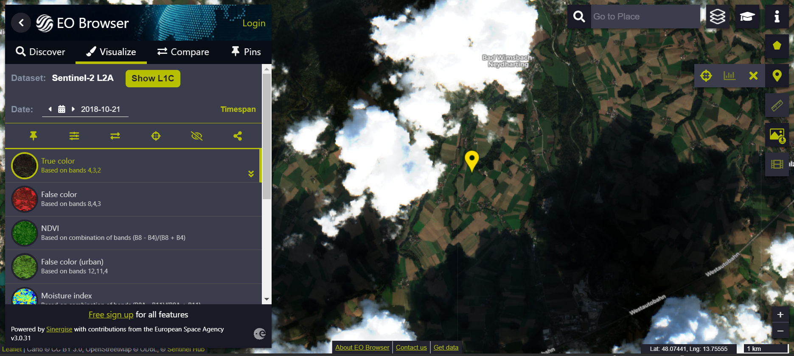{width=100%}

</center>

However, suppose you search for images using the image-wide cloud statistics common in image databases. In that case, this image will never be returned due to the overall cloud contamination. In contrast, the Sen2Cube.at system allows specifying explicitly an area-of-interest and a cloud filter that will be evaluated only for this area. Subsequently, you receive better information about which images can be used or not for your application.

<center>
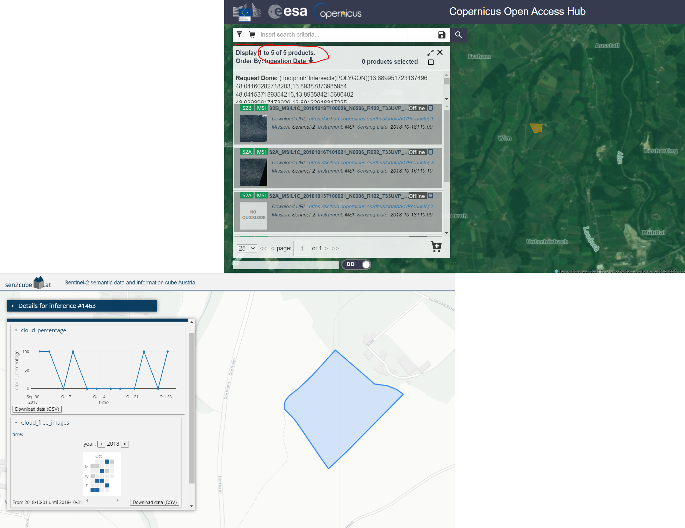{width=100%}

</center>

```{block, type='rmdtip'}
Why don't you try it out on your own? After reading the "Getting started" chapter, come back here and use the "SCBIR - Cloud" model, [this area-of-interest](https://demo.sen2cube.at/ows/000/?service=WFS&version=1.1.0&request=GetFeature&outputFormat=application/json&srsname=EPSG:4326&typename=inspire_feldstuecke_2019&Filter=%3CFilter%3E%3CPropertyIsEqualTo%3E%3CPropertyName%3EFS_KENNUNG%3C/PropertyName%3E%3CLiteral%3E79707084%3C/Literal%3E%3C/PropertyIsEqualTo%3E%3C/Filter%3E)
and October 2018 as time interval.
```

### Cloud-free composite

Most applications for Earth observation of land consider clouds as noise and not as valid observations. One approach to managing cloud contamination that is feasible in many situations is to create a cloud-free composite. This means creating an artificial image where cloud-free (or "best") pixels are selected and stitched together using some user-defined rules. Since a basic interpretation of the observations is already available in Sen2Cube.at, a cloud-free composite based on pre-selecting valid observations is easily possible. This example is an artificial image of cloud-free Vienna during Summer 2018:


<center>
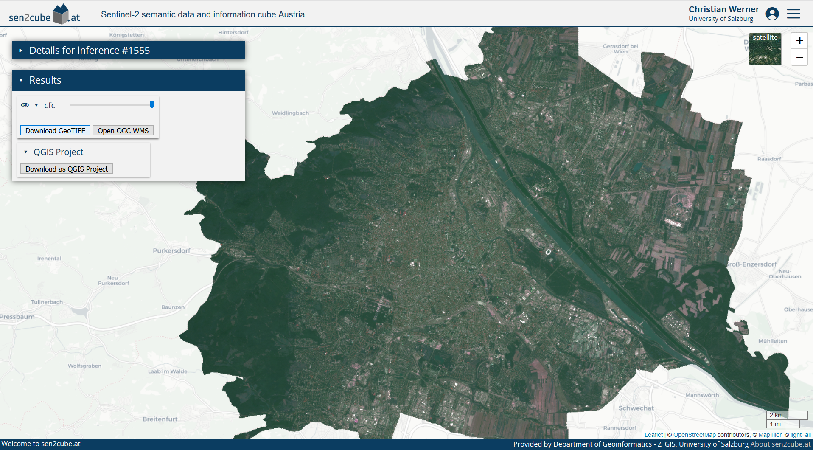{width=100%}

</center>

```{block, type='rmdtip'}
You may notice that the extent is cropped to the borders of Vienna: You don't have to digitize your area-of-interest manually. Every valid GeoJSON can be input, even if it is located online. Here, the borders are directly downloaded as [OGC Web Feature Service](https://data.wien.gv.at/daten/geo?service=WFS&request=GetFeature&version=1.1.0&typeName=ogdwien:LANDESGRENZEOGD&srsName=EPSG:4326&outputFormat=json) from the [Open Data Portal of Vienna](https://www.data.gv.at/katalog/dataset/86c29af5-c52c-423d-8764-82c1bb037936).
```

The Stubaital during spring reveals that there is still snow on the higher elevated areas.

<center>
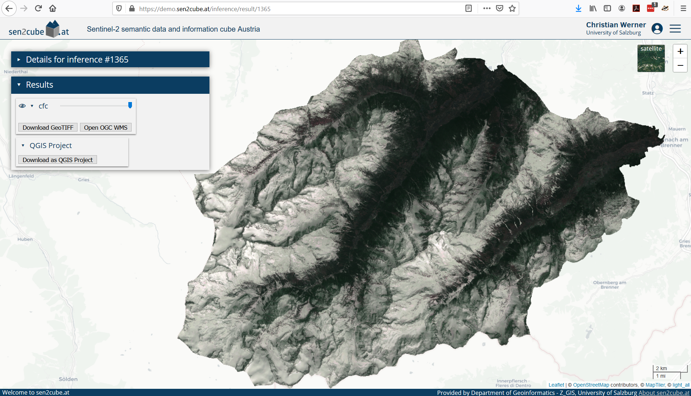{width=100%}

</center>

A cloud-free composite of observations from spring is not useful for your application? No problem - chose any other time interval. You don't need to rely on pre-manufactured cloud-free composites. In Sen2Cube.at, you can configure these parameters and produce ad-hoc cloud-free composites from an area-of-interest and a time interval you are interested in.

```{block, type='rmdtip'}
The result of every inference is available as OGC Web Map Service - you can simply add them in your GIS.
<center>
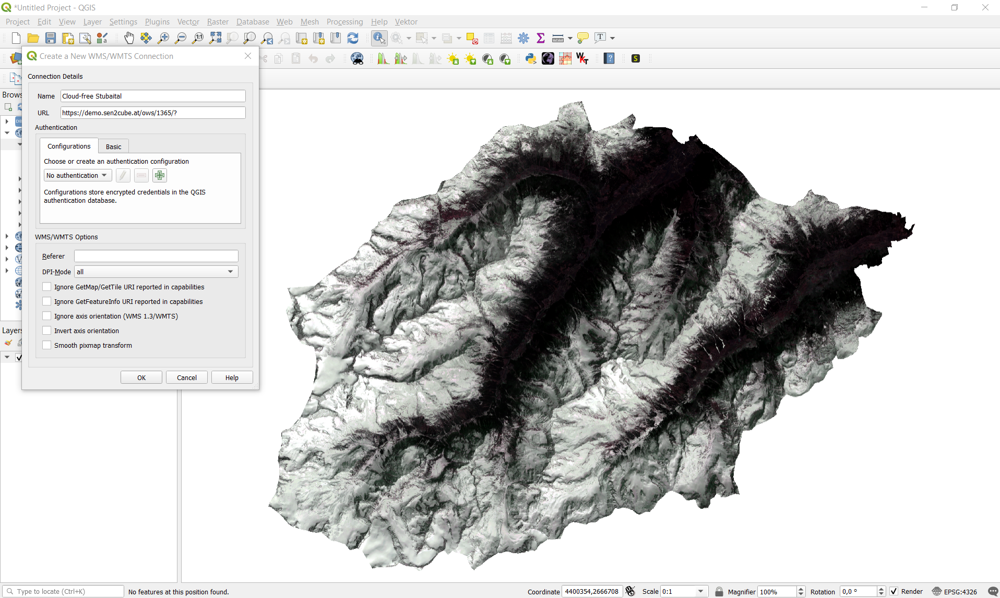{width=100%}
</center>
```


### Time series

Continuous Earth observation with acquisition frequencies of a few days allows extracting relevant patterns based on (long) time series of a selected variable. For example, using the appearance of "greenness" of the observations as the variable of interest, it is possible to trace back changes on the Earth's surface. The following image shows an area where an industrial/commercial building was constructed on a meadow.

<center>
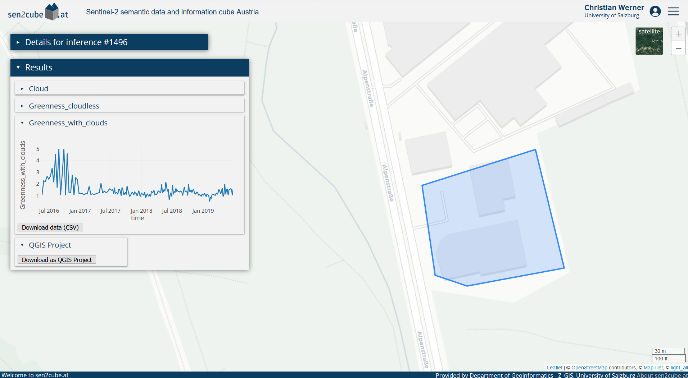{width=100%}

</center>

During the first year of operational Sentinel-2 image acquisition (2015-2016), the temporal pattern of the observations indicates the yearly cycle of vegetation in the northern hemisphere. However, after the construction and opening of the building in May 2018, the temporal pattern changed utterly. The remaining variations are due to noise and perhaps smaller patches of grass in between the buildings.

Using the same greenness variable applied to agricultural fields may reveal changes in crop types or agricultural use. In this example, the use of one agricultural field changed between 2018 and 2019. While you can identify two main peaks in the years until (and including) 2018, there is only one peak in 2019 and 2020.

<center>
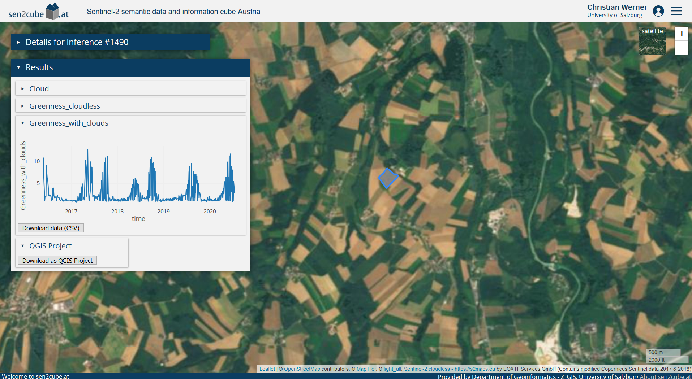{width=100%}

</center>

<!--
### Area-based statistics

In cases when defined geographic regions area already available you may want to augment their attribute table with aggregated Earth-observation-based information. For example: What's Viennas 'greenest' district?

-->

### Spatially disaggregated information

**Surface water**

Some borders defined in (vector) databases of geographical objects indicate only one value, such as an average, for the entire object. One example is water bodies: While they are represented as stable with a clearly defined border, they undergo many changes over time. Spatially disaggregated information from Earth observation data allows us to investigate these in unprecedented spatio-temporal detail. Earth observations of one year covering parts of the Lake of Constance reveals the dynamics at the mouth of the Rhine River and the Bregenzerach. It allows us to see more details than the simple polygon in the geographical database.

<center>
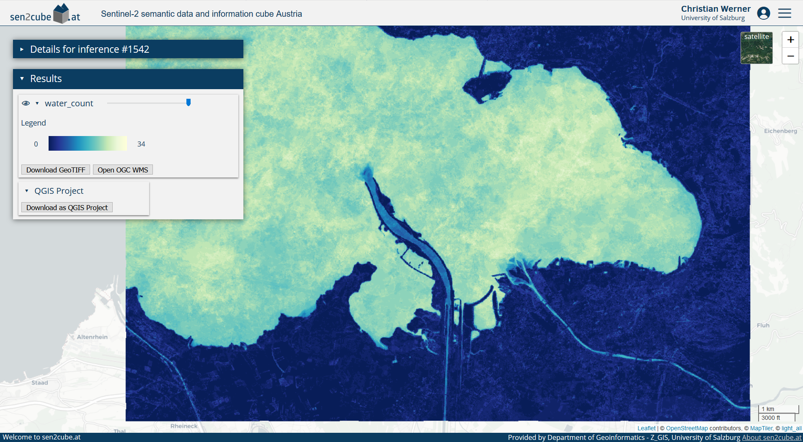{width=100%}

</center>

<center>
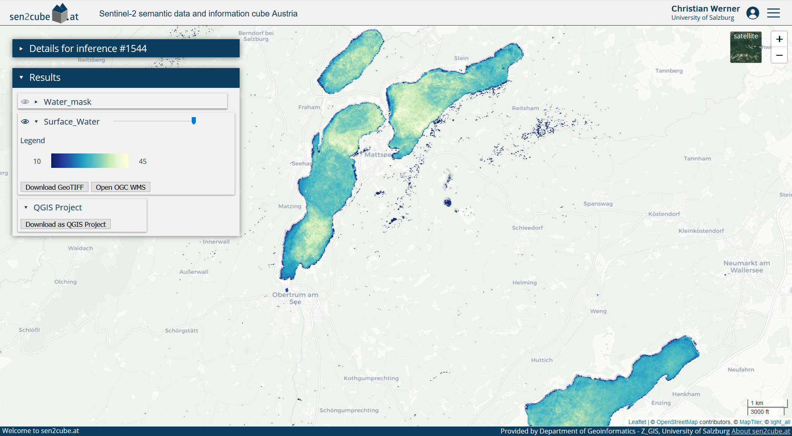{width=100%}

</center>

Another use case of spatially disaggregated information is to detect missing or changed geographical objects in other databases. For example, the dam "Donaukraftwerk Melk" is not yet present in the geographical database ...

<center>
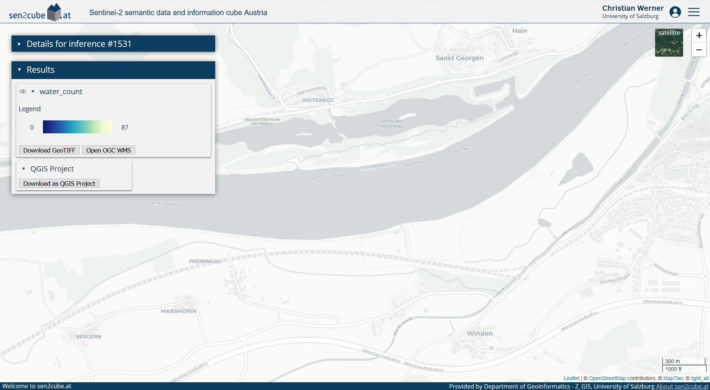{width=100%}

</center>

... it is already clearly visible in the Earth-observation-based information.

<center>
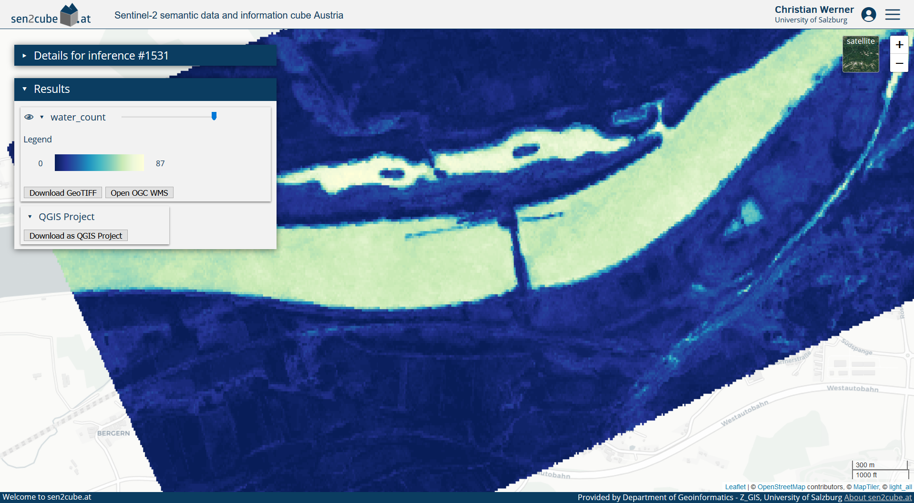{width=100%}

</center>

**Urban green areas**

Other geographical phenomena and objects might be spatially arranged within a region. For example, consider the green areas within Vienna, which are an essential contribution to the well-being of humans and animals and can cool down the city in summer. We will again use the official borders as distributed by the Open Data Platform. The resulting map shows the percentage of valid observations (i.e. observations that are not cloud) associated with a vegetation type for the specified timespan.

<center>
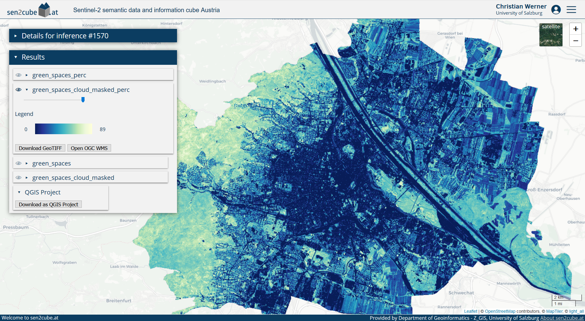{width=100%}

</center>

Further re-use of intermediate results is also possible. For example, the colour ramp produces a nice visual output. Still, it might be more beneficial to apply a threshold and delineate areas that might be considered stable vegetation or green spaces.

<center>
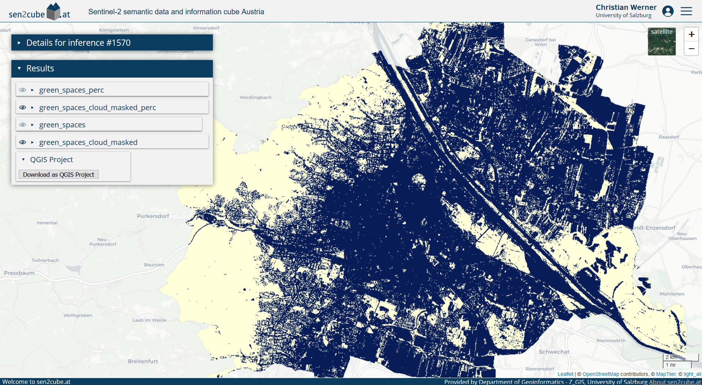{width=100%}

</center>

## Next steps and how to start

```{block, type='rmdnote'}
The Sen2Cube.at system was not explicitly designed for any of the use-cases presented in the last section. All of them were created using the same generic semantic enrichment and generic building blocks of the semantic query language to construct the different queries for each example. Still, it is not necessary to do any programming - you don't have to trade-of between the need for programming or flexibility of the software.
```

A good start to get familiar with the Sen2Cube.at system is to read how we conduct the [Semantic Enrichment](#enrichment) of Earth observation data and then proceed with the [Getting Started](#start) section and try to use or build your first model.

## More information and community access

This manual gives a lot of information on how to use the Sen2Cube.at system. Still, some parts might be unclear or specific questions may arise. Feel free to use our community forum to ask: [https://forum.sen2cube.at/](https://forum.sen2cube.at/). The forum account (including username and password) is the same as your overall Sen2Cube.at account. Thus, you can directly log in by clicking on the icon below the text "Alternative Login" ...

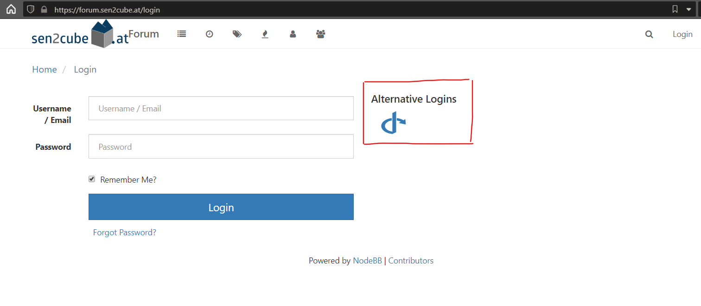{width=100%}

... and you will be forwarded to the Sen2Cube.at login page and then redirected to the forum.