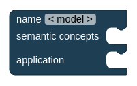
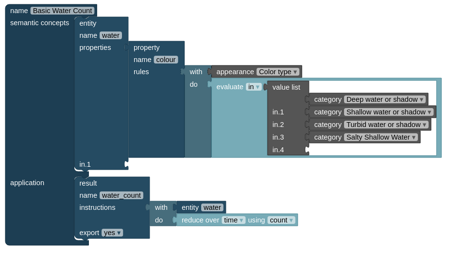

---
output:
  html_document: default
  pdf_document: default
---
# Model structure {#model}

The model itself defines the output. Besides choosing from pre-constructed models within the knowledgebase, new models can be constructed from scratch. There are two main components that define a model:

- The **semantic concept dictionary** serves as a translator between descriptions of real-world entities and raw image data. For example, if we want to know which observations can be identified as *water*, we need to specify *how* we define water given the data that we have. What does *water* mean in terms of our data values? Creating a semantic concept dictionary requires expert knowledge and is usually not a task that non-experts take on by themselves.
- The **application** component is then used to formulate the semantic query by using the defined semantic concepts directly. Since it is defined what *water* means in terms of the data, we don't have to worry about the raw data anymore, but can use common language to describe our desired output. For example "how many observations where defined as water inside my area-of-interest, during July 2020". Such a question forms a single result. A model can contain multiple results.

The model construction is designed to be as intuitive as possible by connecting several *building blocks*, that all represent a distinct, clearly defined task or value. See the building blocks chapter (\@ref(blocks)) for an in-depth description of them. The starting point is an *empty model*:

{width=50%}

See below an example of a simple model. In the semantic concept dictionary, the entity *water* is defined in terms of the data. Each observation inside the spatio-temporal extent of the query is labelled as either being water, or not. The application component contains a single result, in which the number of water observations are counted over time.

{width=100%}

The result is a map in which each spatial location (modelled as a cell in a spatial grid) contains a *water count* value.

{width=100%}

The following video shows the development process of a model (*External Youtube Link*).

[{width=100%}](https://youtu.be/oiJt61CONqA)

