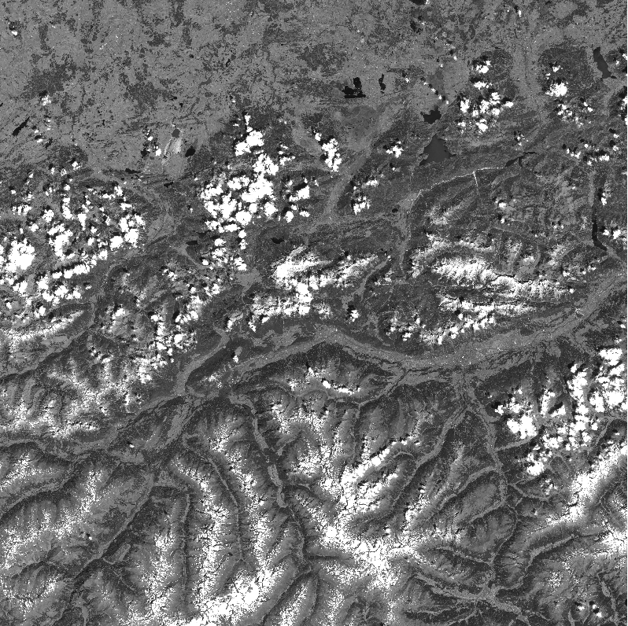
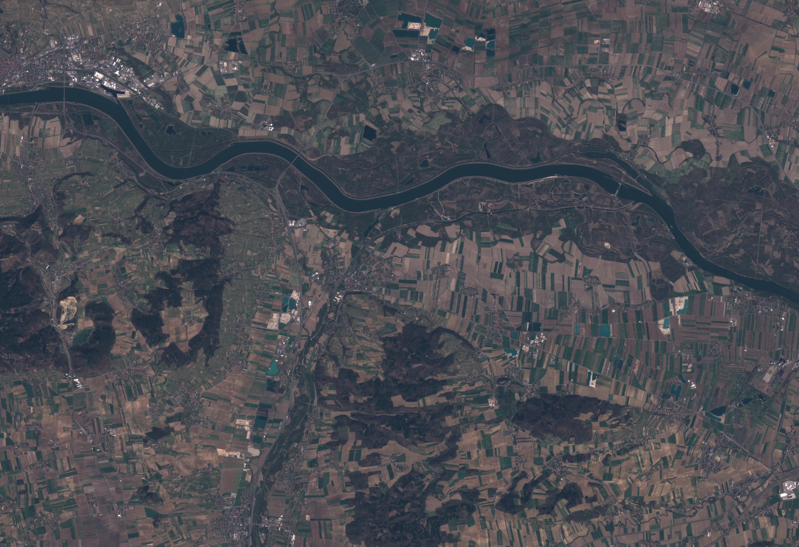
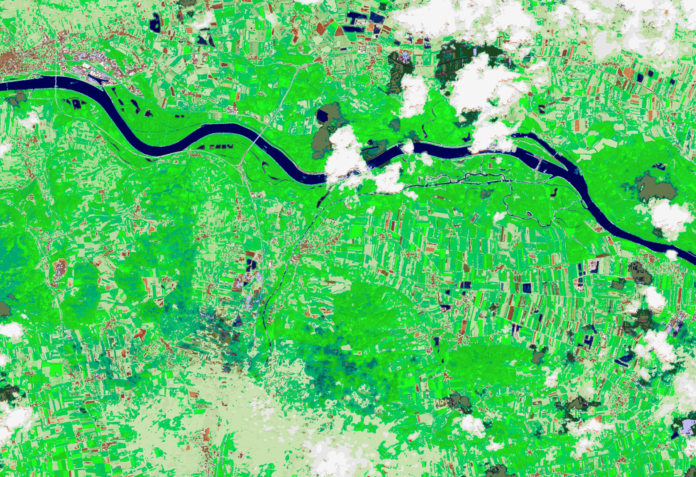

# Semantic Enrichment {#enrichment}

Semantic enrichment in the EO imagery domain refers to interpreted content of EO imagery (i.e., mapping data to symbols that represent stable concepts). In the case of EO imagery represented in a raster (i.e., image), this means mapping each raster cell (i.e., pixel) to an interpretation that represents a stable concept. These concepts are generally non-ordinal, categorical variables. However, subsets of these variables may be ordinal (e.g., vegetation categorised by increasing greenness or intensity). The relative level of semantic enrichment can vary in complexity and the "symbolic" level of the concepts/variables. Concepts represented by a relatively lower level of semantic enrichment could be considered semi-symbolic. These concepts are a first step towards connecting sensory data to stable, symbolic, semantic classes and are required to be enriched further in semantic models. In contrast, examples of a relatively high level of semantic enrichment are existing ontologies such as the land cover classification system (LCCS) developed by the United Nations Food and Agriculture Organisation (UN-FAO), particularly the modular phase. Semantically enriched EO imagery time-series can be used to create semantically-enabled EO data cubes (i.e., semantic EO data cubes).

There are multiple methods and tools that exist for semantically enriching EO imagery. In the context of the Sen2Cube.at system, the [SIAM](#siam) software has been used, but others are possible.

## Satellite Image Automatic Mapper (SIAM) {#siam}

The SIAM software generates relatively low-level, generic, data-derived semantic enrichment that is application- and user-independent, meaning it can support multiple application domains. Using a per-pixel physical spectral model-based decision tree, SIAM automatically categorises EO imagery that is calibrated to at least top-of-atmosphere (TOA) reflectance from multiple optical sensors (e.g., Sentinel-2, Landsat-8, AVHRR, VHR). SIAM is considered automatic because it runs without any user-defined parameterisation or training data instead of relying on *a priori* knowledge. The decision tree maps each calibrated observation to one stable, sensor-agnostic multi-spectral colour name (i.e., category) based on its location in a multi-spectral reflectance hypercube. The result is a discrete and finite vocabulary for observations that refer to a hyper-polyhedra (e.g., multi-dimensional shape) within a multi-spectral feature space. This vocabulary (i.e., colour names/categories) is mutually exclusive (i.e, every observation belongs to one single partition) and totally exhaustive (i.e., the entire multi-spectral reflectance hypercube is partitioned). These colour names have semantic associations using a knowledge-based approach. These colour names are semi-symbolic and can be thought of as stable, sensor-agnostic visual "letters" that can be used to build "words" (i.e., symbolic concepts) that have a higher semantic level using knowledge-based rules. The relatively low-level semantic enrichment automatically generated by SIAM has been independently validated up to a continental scale.

The software is capable of producing different granularities (i.e. different number of colour names) from coarse (i.e., 18 colour names) to fine (i.e., 96 colour names), as well as additional data-derived information layers (e.g., multi-spectral greenness index, brightness).

SIAM's 33 colour name granularity is exemplarily utilised within the Sen2Cube.at system as the basis for semantic queries.

 The following table shows the legend of the SIAM names (spectral categories) that can currently be selected and used in Sen2Cube.at for analyses and evaluations through time:

Table: (\#tab:siamnames) 33 SIAM color names available in Sen2Cube.at

| Nr          | Abbreviation| Description of the spectral category (not land cover) | category
|------------:|------------:|------------:|------------:|
|           1 | SVHNIR      | Strong vegetation with high NIR | appearance |
|           2 | SVLNIR      | Strong vegetation with low NIR | appearance |
|           3 | AVHNIR      | Average vegetation with high NIR | appearance |
|           4 | AVLNIR      | Average vegetation with low NIR | appearance |
|           5 | WV          | Weak vegetation | appearance |
|           6 | SHV         | Shadow area with vegetation | appearance |
|           7 | SHRBRHNIR   | Shrub Rangeland with High NIR | appearance |
|           8 | SHRBRLNIR   | Shrub Rangeland with Low NIR | appearance |
|           9 | HRBCR       | Herbaceous Rangeland | appearance |
|          10 | WR          | Weak Rangeland | appearance |
|          11 | PB          | Pit or bog     | appearance |
|          12 | GH          | Greenhouse  | appearance |
|          13 | VBBB        | Very bright barren land or built-up | appearance |
|          14 | BBB         | Bright barren land or built-up | appearance |
|          15 | SBB         | Strong barren land or built-up | appearance |
|          16 | ABB         | Average barren land or built-up | appearance |
|          17 | DBB         | Dark barren land or built-up | appearance |
|          18 | WBBorSHB    | Weak barren land or Shadow area with Barren Land | appearance |
|          19 | NIRPBB      | Near InfraRed-Peaked Barren land or Built-up | appearance |
|          20 | BA          | Burned area | appearance |
|          21 | DPWASH      | Deep water or shadow | appearance |
|          22 | SLWASH      | Shallow water or shadow | appearance |
|          23 | TWASH       |  Turbid water or shadow | appearance |
|          24 | SASLWA      | Salty Shallow Water | appearance |
|          25 | CL          | Cloud       | atmosphere |
|          26 | SMKPLM      | Smoke Plume | atmosphere |
|          27 | TNCLV       | Thin clouds over vegetation | appearance |
|          28 | TNCLWA_BB   | Thin clouds over water area or Barren land or Built-up areas | appearance |
|          29 | SN          | Snow or water ice | appearance |
|          30 | SHSN        | Shadow Snow  | appearance |
|          31 | SH          | Shadow areas | appearance |
|          32 | FLAME       | Flame        | appearance |
|          33 | UN          | Unknown      | appearance |
|         255 | NO DATA     | No data      | 

The following additional information layers are available:

**Greenness** 

The greenness information layer is a multi-spectral greenness index (> 0) in the appearance category.

{width=100%}

**Brightness** 

The brightness information layer is a brightness index (> 0) in the appearance category.

{width=100%}

**Haze mask** 

The haze mask information layer is a haze mask with five categories in the atmosphere category.

{width=100%}

### Applied in Austria {#siam_examples_austria}

Here are a few examples of the generic, low-level semantic enrichment generated by SIAM at its highest granularity (i.e., 33 colour names) applied to Sentinel-2 imagery. These colour spaces are represented by colours based on their semantic association:

{width=100%}

Sentinel-2 imagery covering Austria from 18 September 2019, 05 April 2020 and 24 June 2020 have been exemplarily discretised into multi-spectral colour spaces with SIAM.

{width=100%}

{width=100%}

{width=100%}

{width=100%}

{width=100%}

{width=100%}

