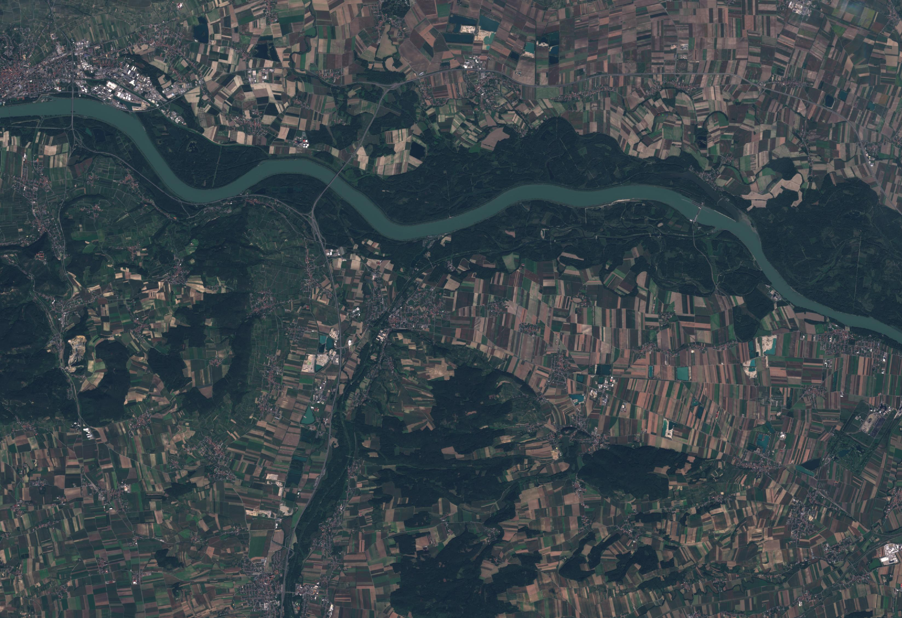
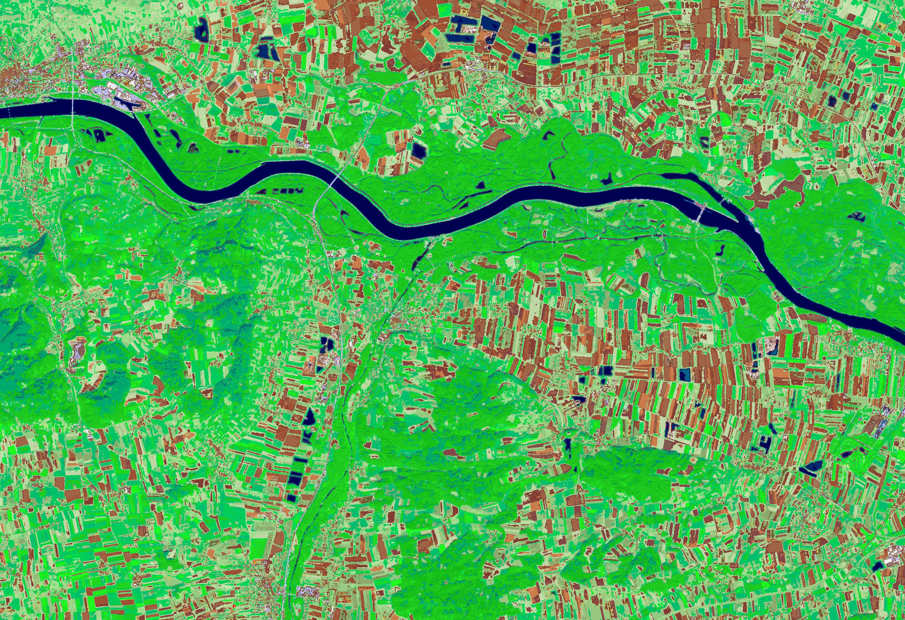
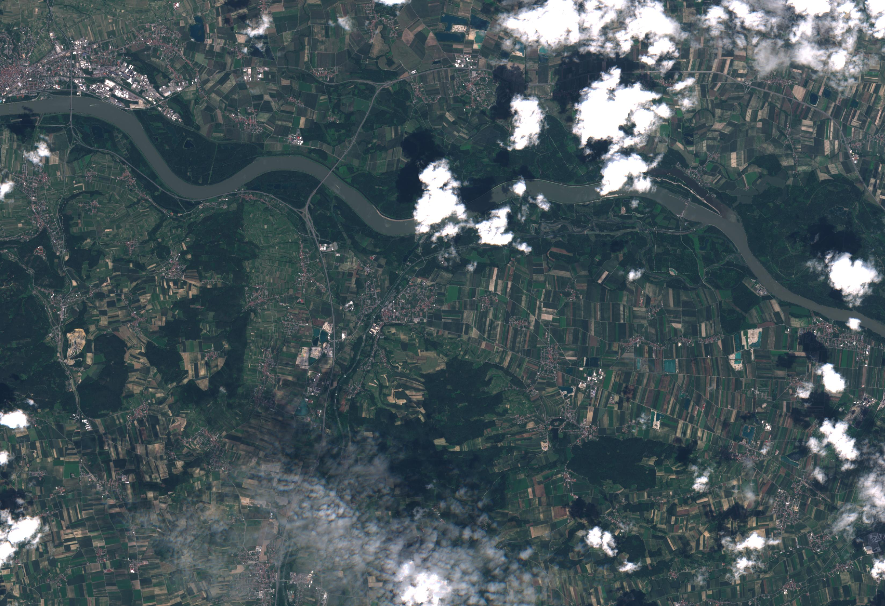

# Semantic Enrichment {#enrichment}

Semantic enrichment in the EO imagery domain refers to interpreted content of EO imagery (i.e., mapping data to symbols that represent stable concepts). In the case of EO imagery represented in a raster (i.e., image), this means mapping each raster cell (i.e., pixel) to an interpretation that represents a stable concept. These concepts are generally non-ordinal, categorical variables, however, subsets of these variables may be ordinal (e.g., vegetation categorized by increasing greenness or intensity). The relative level of semantic enrichment can vary in terms of complexity and the "symbolic" level of the concepts/variables. Concepts represented by a relatively lower level of semantic enrichment could be considered semi-symbolic, meaning that they are a first step towards connecting sensory data to symbolic, semantic classes (e.g., color as perceived by human vision, multi-dimensional "color", other ways of characterising the spatio-temporal context of each observation). A relatively high level of semantic enrichment refers to explicit expert knowledge or existing ontologies (e.g., land cover classification system (LCCS) developed by the United Nations Food and Agriculture Organisation (UN-FAO)). Semantically enriched EO imagery time-series can be used to create semantically-enabled EO data cubes (i.e., semantic EO data cubes).

There are multiple methods and tools that exist for semantically enriching EO imagery. In the context of the sen2cube.at project, the [SIAM](#siam) software has been used, but others are possible.

## Satellite Image Automatic Mapper (SIAM) {#siam}

The SIAM software generates relatively low-level, generic, data-derived semantic enrichment that is application- and user-independent, meaning it is able to support multiple application domains. Using a per-pixel physical spectral model-based decision tree, SIAM automatically categorizes EO imagery that is calibrated to at least top-of-atmosphere (TOA) reflectance from multiple optical sensors (e.g., Sentinel-2, Landsat-8, AVHRR, VHR). SIAM is considered automatic because it runs without any user-defined parameterisation or training data, instead relying on *a priori* knowledge. The decision tree maps each calibrated observation to one stable, sensor-agnostic multi-spectral color name (i.e., category) based on its location in a multi-spectral reflectance hypercube. The result is a discrete and finite vocabulary for observations that refer to  a hyper-polyhedra (e.g., multi-dimensional shape) within a multi-spectral feature space. This vocabulary (i.e., color names/categories) is mutually exclusive (i.e, every observation belongs to one single partition) and totally exhaustive (i.e., the entire multi-spectral reflectance hypercube is partitioned). These color names have semantic associations using a knowledge-based approach. These color names are semi-symbolic, and can be thought of as stable, sensor-agnostic visual "letters" that can be used to build "words" (i.e., symbolic concepts) that have a higher semantic level using knowledge based rules. The relatively low level semantic enrichment automatically generated by SIAM has been independently validated up to a continental scale.

The software is capable of producing different granularities (i.e. different number of color names) from coarse (i.e., 18 color names) to fine (i.e., 96 color names), as well as additional data-derived information layers (e.g., multi-spectral greenness index, brightness).

SIAM's 33 color name granularity is exemplarily utilized within the sen2cube.at project as the basis for semantic queries.

### Applied in Austria {#siam_examples_austria}

Here are a few examples of the generic, low level semantic enrichment generated by SIAM at its highest granularity (i.e., 96 color names) applied to Sentinel-2 imagery. These color spaces are represented by colors based on their semantic association:

{width=100%}

Sentinel-2 imagery covering Austria from 18 September 2019, 05 April 2020 and 24 June 2020 have been exemplarily discretized into 96 multi-spectral color spaces with SIAM.

{width=100%}

{width=100%}

{width=100%}

{width=100%}

{width=100%}

{width=100%}

